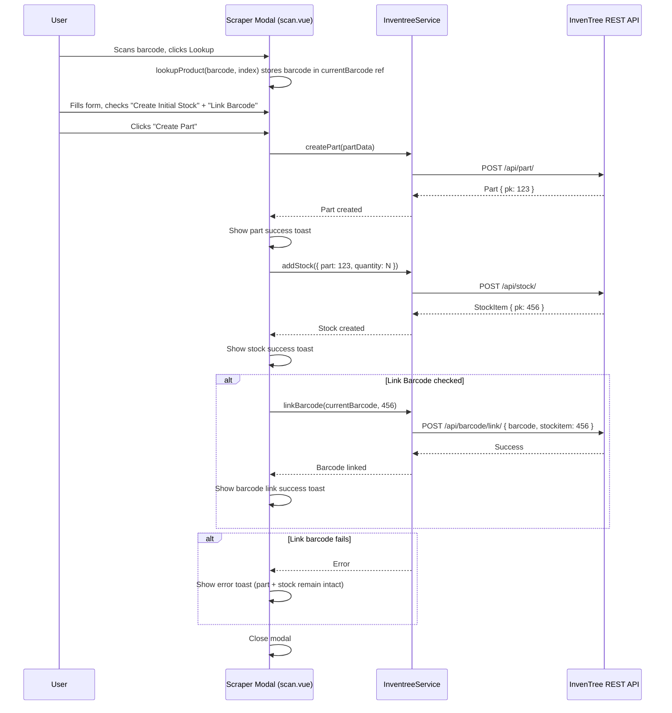

# Design Document: Barcode Link to Stock Item

## Overview

This design adds the ability to link a scanned barcode to a newly created stock item during the part creation flow on the Scan Page (`/scan`). The feature extends the existing Scraper Modal with a conditional "Link Barcode to Stock Item" checkbox and adds a `linkBarcode` method to `InventreeService`.

The implementation touches two files:

1. **`app/pages/scan.vue`** — A new `linkBarcode` checkbox (visible only when "Create Initial Stock" is checked, defaults to checked), a `currentBarcode` ref to capture the barcode from `lookupProduct`, and an additional step in `createPart` that calls the barcode link API after successful stock creation.
2. **`app/services/inventree.service.ts`** — A new `linkBarcode(barcode, stockItemPk)` method that POSTs to `/barcode/link/`.

No new files, components, or composables are created. The feature follows the same incremental extension pattern used by the initial-stock-quantity-scanner spec.

## Architecture



The flow is strictly sequential: part → stock → barcode link. Each step depends on the previous succeeding. If stock creation fails, barcode linking is skipped. If barcode linking fails, the part and stock remain intact.

## Components and Interfaces

### Modified: `app/services/inventree.service.ts`

A single new method is added to the existing `InventreeService` class:

```typescript
/**
 * Link a barcode to a stock item via InvenTree's barcode assignment API.
 */
async linkBarcode(barcode: string, stockItemPk: number): Promise<void> {
  await this.api('/barcode/link/', {
    method: 'POST',
    body: { barcode, stockitem: stockItemPk }
  })
}
```

The method is intentionally minimal — it sends the POST and lets errors propagate to the caller. No return value is needed since the caller only cares about success/failure.

### Modified: `app/pages/scan.vue`

#### New Reactive State

```typescript
const linkBarcode = ref(true)
const currentBarcode = ref<string | null>(null)
```

- `linkBarcode` — controls the "Link Barcode to Stock Item" checkbox. Defaults to `true` (checked).
- `currentBarcode` — stores the barcode string that triggered the current product lookup. Set in `lookupProduct`, used in `createPart`.

#### Modified `lookupProduct` Function

The barcode parameter is captured before the API call:

```typescript
const lookupProduct = async (barcode: string, index: number) => {
  // ... existing code ...
  if (response.success && response.data) {
    // ... existing form population ...
    currentBarcode.value = barcode  // NEW: capture the barcode
    createStock.value = false
    stockQuantity.value = 1
    linkBarcode.value = true        // NEW: reset to default checked
    isModalOpen.value = true
  }
}
```

#### Modified `createPart` Function

After the existing stock creation block, a new barcode linking block is added:

```typescript
// Inside createPart, after the addStock try/catch block:
if (createStock.value) {
  let stockItem: StockItem | undefined
  try {
    const stockData: AddStockDto = {
      part: response.pk,
      quantity: stockQuantity.value,
      notes: 'Initial stock created with part'
    }
    stockItem = await inventree.addStock(stockData)
    toast.add({
      title: 'Initial stock added',
      description: `${stockQuantity.value} units`,
      color: 'success'
    })
  } catch (stockError) {
    const message = stockError instanceof Error ? stockError.message : 'Failed to add stock'
    toast.add({
      title: 'Failed to add initial stock',
      description: message,
      color: 'error'
    })
  }

  // NEW: Link barcode to stock item
  if (stockItem && linkBarcode.value && currentBarcode.value) {
    try {
      await inventree.linkBarcode(currentBarcode.value, stockItem.pk)
      toast.add({
        title: 'Barcode linked to stock item',
        description: `Barcode: ${currentBarcode.value}`,
        color: 'success'
      })
    } catch (linkError) {
      const message = linkError instanceof Error ? linkError.message : 'Failed to link barcode'
      toast.add({
        title: 'Failed to link barcode',
        description: message,
        color: 'error'
      })
    }
  }
}
```

Key detail: `stockItem` is captured from the `addStock` return value. If `addStock` throws, `stockItem` remains `undefined` and the barcode linking block is skipped entirely.

#### Template Addition

The link barcode checkbox is added inside the existing stock controls section, below the quantity input:

```vue
<!-- Inside the createStock conditional block, after the Stock Quantity UFormField -->
<div v-if="createStock" class="flex items-center gap-2 mt-3">
  <UCheckbox v-model="linkBarcode" />
  <div>
    <label class="text-sm font-medium">Link Barcode to Stock Item</label>
    <p class="text-xs text-gray-500">
      Link barcode {{ currentBarcode }} to the new stock item
    </p>
  </div>
</div>
```

The checkbox is only visible when `createStock` is checked (it's inside the same `v-if="createStock"` block). The description shows the actual barcode value so the user can verify which barcode will be linked.

## Data Models

### New Type (No new file needed — added to existing types)

No new DTO type is required. The `linkBarcode` method accepts primitive parameters (`string`, `number`) and constructs the request body inline. This keeps the API surface minimal.

### Modified Reactive State (scan.vue internal)

```typescript
const linkBarcode: Ref<boolean>          // defaults to true
const currentBarcode: Ref<string | null> // set by lookupProduct, null initially
```

### Existing Types Used (No Changes)

```typescript
// From app/types/inventree.ts — used as-is
interface StockItem {
  pk: number
  // ... other fields
}

interface AddStockDto {
  part: number
  quantity: number
  location?: number | null
  notes?: string
}
```

### File Changes Summary

| File | Change |
|---|---|
| `app/services/inventree.service.ts` | Add `linkBarcode(barcode, stockItemPk)` method |
| `app/pages/scan.vue` | Add `linkBarcode` ref, `currentBarcode` ref, capture barcode in `lookupProduct`, add barcode link step in `createPart`, add checkbox UI |

No new files. No type changes.


## Correctness Properties

*A property is a characteristic or behavior that should hold true across all valid executions of a system — essentially, a formal statement about what the system should do. Properties serve as the bridge between human-readable specifications and machine-verifiable correctness guarantees.*

### Property 1: Link checkbox visibility matches createStock state

*For any* sequence of createStock checkbox toggles (checked/unchecked), the "Link Barcode to Stock Item" checkbox should be visible if and only if createStock is currently checked.

**Validates: Requirements 1.1, 1.2**

### Property 2: linkBarcode resets to checked on every modal open

*For any* sequence of modal interactions (open, toggle linkBarcode to unchecked, close, open again), each time the modal opens with new scraped data via `lookupProduct`, the linkBarcode checkbox should be checked (true), regardless of what value it had during the previous modal session.

**Validates: Requirements 1.3, 5.1, 5.2**

### Property 3: Barcode link API called if and only if all preconditions met

*For any* combination of createStock state (boolean), linkBarcode state (boolean), and stock creation outcome (success/failure), the `linkBarcode` service method should be called exactly when all three conditions hold: createStock is checked, linkBarcode is checked, and stock creation succeeded. In all other cases, the method should not be called.

**Validates: Requirements 2.1, 2.4, 2.5**

### Property 4: Successful barcode link shows success toast with barcode value

*For any* barcode string and stock item pk where the barcode link API succeeds, the system should display a success toast containing the barcode value that was linked.

**Validates: Requirements 2.2**

### Property 5: Service linkBarcode POSTs correct payload

*For any* barcode string and positive integer stock item pk, calling `InventreeService.linkBarcode(barcode, pk)` should send a POST request to `/barcode/link/` with body `{ barcode: "<barcode>", stockitem: <pk> }`.

**Validates: Requirements 3.2**

### Property 6: currentBarcode captures the lookup barcode

*For any* barcode string passed to `lookupProduct` that results in a successful scrape, the `currentBarcode` ref should equal that barcode string, and this is the value forwarded to the barcode link API call.

**Validates: Requirements 4.1, 4.2**

### Property 7: Checkbox description displays the barcode value

*For any* barcode string stored in `currentBarcode`, the Link_Barcode_Checkbox description text should contain that barcode string so the user can verify which barcode will be linked.

**Validates: Requirements 4.3**

## Error Handling

| Error Condition | Behavior |
|---|---|
| Part creation fails | Error toast shown, modal stays open, neither `addStock` nor `linkBarcode` is called |
| Part succeeds, stock creation fails | Part success toast shown, stock error toast shown, `linkBarcode` is NOT called, modal closes |
| Part + stock succeed, barcode link fails | Part + stock success toasts shown, barcode link error toast shown with failure reason, modal closes. Part and stock remain intact in InvenTree. |
| `currentBarcode` is null when link is attempted | Guard condition (`currentBarcode.value` check) prevents the API call. This should not happen in normal flow since `lookupProduct` always sets it. |
| Barcode already linked to another item (409/400 from API) | Error propagates from `linkBarcode`, caught in the try/catch, error toast displayed with the API error message |

The error handling follows the same pattern as the initial-stock-quantity-scanner: each step is best-effort after the critical path (part creation). If barcode linking fails, the user can always link the barcode manually via InvenTree's UI.

## Testing Strategy

### Property-Based Testing

The project uses **fast-check** (`fast-check@^4.5.3`) with **vitest** (`vitest@^3.2.4`). All property tests use this existing setup.

Each correctness property maps to a single property-based test with a minimum of 100 iterations. Tests are tagged with comments referencing the design property:

```typescript
// Feature: barcode-link-stock, Property 3: Barcode link API called if and only if all preconditions met
```

**Key arbitraries (generators):**

| Arbitrary | Description |
|---|---|
| `barcodeArb` | `fc.string({ minLength: 1, maxLength: 50 }).filter(s => s.trim().length > 0)` — non-empty barcode strings |
| `stockItemPkArb` | `fc.integer({ min: 1, max: 100000 })` — valid stock item primary keys |
| `partPkArb` | `fc.integer({ min: 1, max: 100000 })` — valid part primary keys |
| `quantityArb` | `fc.integer({ min: 1, max: 10000 })` — valid stock quantities |
| `createStockArb` | `fc.boolean()` — createStock checkbox state |
| `linkBarcodeArb` | `fc.boolean()` — linkBarcode checkbox state |
| `stockSuccessArb` | `fc.boolean()` — whether addStock succeeds or throws |

**Mocking strategy:**
- `useInventreeApi()` → mock returning a stub `InventreeService` with controllable `createPart`, `addStock`, and `linkBarcode` responses
- `useToast()` → mock `toast.add` to capture toast calls and verify titles/descriptions/colors
- `$fetch` → mock for the scrape endpoint to provide controlled scraped data

### Unit Tests (Examples and Edge Cases)

Unit tests cover specific examples and edge cases that don't need property-based coverage:

**Service tests** (`app/services/__tests__/inventree.service.spec.ts`):
- `linkBarcode` method exists and accepts (string, number) parameters (Req 3.1 — example)
- `linkBarcode` propagates API errors to caller (Req 3.3 — edge case)

**Page tests** (`app/pages/__tests__/scan-barcode-link.spec.ts`):
- Link checkbox label reads "Link Barcode to Stock Item" (Req 1.4 — example)
- Barcode link failure shows error toast with failure reason, part and stock remain (Req 2.3 — edge case)
- Closing modal without submitting does not affect next open's linkBarcode state (Req 5.2 — edge case)
