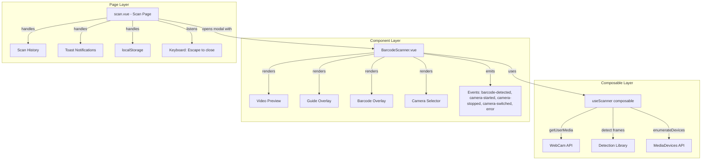
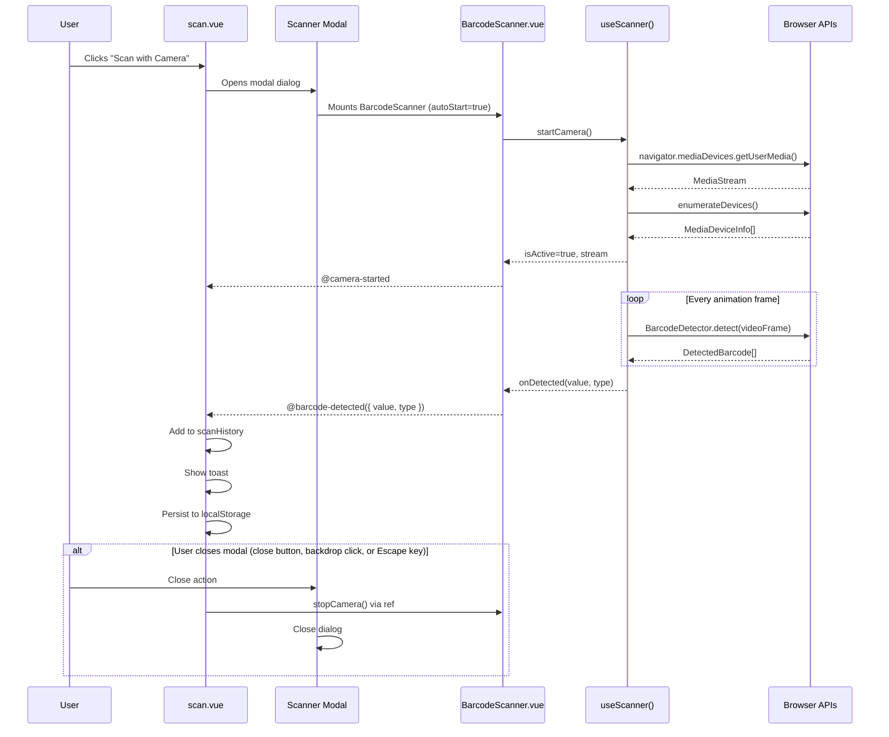

# Design Document: Barcode Scanner

## Overview

This design adds webcam-based barcode scanning to the XTS inventory application. The feature is structured in three layers:

1. **`useScanner` composable** — headless logic for webcam access, camera enumeration, stream lifecycle, and barcode detection. Zero UI, zero page-specific coupling.
2. **`BarcodeScanner` component** — reusable Vue component wrapping the composable. Provides camera preview, visual feedback (guide overlay, barcode highlight, green flash, beep), camera selection UI, and a clean props/events/slots API.
3. **Scan page integration** — the existing `/scan` page presents `BarcodeScanner` inside a modal dialog triggered by a "Scan with Camera" button. The modal wires `barcode-detected` events into scan history, toasts, and localStorage. The modal approach keeps the page layout clean while the component itself remains presentation-agnostic (it can also be used inline elsewhere).

The detection library is [ZXing-js (`@aspect-software/barcode-reader`)](https://github.com/niclas-niclas/aspect-barcode-reader) or, more practically, the **`@aspect-software/barcode-reader`** package. However, given the project's zero-dependency philosophy for detection and broad format support (1D + 2D), we will use **[`zxing-wasm`](https://github.com/niclas-niclas/aspect-barcode-reader)** — a WebAssembly port of ZXing that runs entirely client-side and supports all required formats. If the native `BarcodeDetector` API is available (Chrome 83+, Edge 83+), we use it as a fast path and fall back to the WASM library for unsupported browsers.

### Detection Strategy

```
if (window.BarcodeDetector && allFormatsSupported) {
  // Native BarcodeDetector API — zero bundle cost, hardware-accelerated
} else {
  // zxing-wasm fallback — WASM-based, ~300KB, all formats
}
```

This dual approach gives us native performance where available and full cross-browser coverage.

## Architecture



### Data Flow



## Components and Interfaces

### 1. `useScanner` Composable

**File:** `app/composables/useScanner.ts`

```typescript
interface UseScannerOptions {
  /** Restrict detection to specific barcode formats */
  formats?: BarcodeFormat[]
  /** Cooldown in ms before reporting the same barcode value again. Default: 3000 */
  cooldownMs?: number
  /** Preferred camera device ID */
  cameraDeviceId?: string
  /** Callback invoked when a barcode is detected (after cooldown check) */
  onDetected?: (result: ScanResult) => void
}

interface ScanResult {
  /** The decoded barcode string */
  value: string
  /** The barcode format type label, e.g. "1D - EAN-13" or "2D - QR Code" */
  type: string
  /** Raw format name from the detection library */
  rawFormat: string
  /** Bounding box of the detected barcode in the video frame (if available) */
  boundingBox?: { x: number; y: number; width: number; height: number }
}

interface UseScanner {
  // Reactive state
  isActive: Readonly<Ref<boolean>>
  error: Readonly<Ref<string | null>>
  availableCameras: Readonly<Ref<MediaDeviceInfo[]>>
  lastResult: Readonly<Ref<ScanResult | null>>

  // Methods
  startCamera: (deviceId?: string) => Promise<void>
  stopCamera: () => void
  switchCamera: (deviceId: string) => Promise<void>

  // Internal (for component binding)
  videoRef: Ref<HTMLVideoElement | null>
}
```

**Key behaviors:**
- `startCamera` calls `navigator.mediaDevices.getUserMedia()` with `{ video: { deviceId, facingMode: 'environment' } }`, enumerates devices, and starts the detection loop via `requestAnimationFrame`.
- `stopCamera` stops all `MediaStream` tracks, cancels the detection loop, and resets `isActive`.
- Cooldown tracking uses a `Map<string, number>` mapping barcode values to their last detection timestamp.
- Cleanup is registered via `onUnmounted` to auto-stop the camera when the owning component unmounts.
- The composable contains zero references to scan history, localStorage, toasts, or routing.

### 2. `BarcodeScanner` Component

**File:** `app/components/BarcodeScanner.vue`

```typescript
// Props
interface BarcodeScannerProps {
  /** Barcode formats to detect. Default: all supported formats */
  formats?: BarcodeFormat[]
  /** Cooldown in ms for duplicate scan prevention. Default: 3000 */
  cooldownMs?: number
  /** Preferred camera device ID */
  cameraDeviceId?: string
  /** Show the scanning guide overlay. Default: true */
  showGuide?: boolean
  /** Auto-start camera on mount. Default: false */
  autoStart?: boolean
}

// Emits
interface BarcodeScannerEmits {
  'barcode-detected': [result: ScanResult]
  'camera-started': []
  'camera-stopped': []
  'camera-switched': [deviceId: string]
  'error': [message: string]
}

// Exposed methods (via defineExpose / template ref)
interface BarcodeScannerExposed {
  startCamera: () => Promise<void>
  stopCamera: () => void
}

// Slots
// #guide — replaces the default scanning guide overlay
// #overlay — replaces the default barcode highlight overlay; receives { boundingBox } as slot props
// #feedback — replaces the default green flash feedback
```

**Visual structure:**

```
┌─────────────────────────────────┐
│  Camera Selector (desktop:      │
│  dropdown / mobile: swap icon)  │
├─────────────────────────────────┤
│                                 │
│   ┌───────────────────────┐     │
│   │                       │     │
│   │    Video Preview      │     │
│   │                       │     │
│   │   ┌─────────────┐    │     │
│   │   │ Guide/Overlay│    │     │
│   │   └─────────────┘    │     │
│   │                       │     │
│   │          [📷] (mobile)│     │
│   └───────────────────────┘     │
│                                 │
└─────────────────────────────────┘
```

### 3. Scan Page Integration

**File:** `app/pages/scan.vue` (modified)

The existing scan page gains a "Scan with Camera" button above the manual input. Clicking it opens a modal dialog containing the `BarcodeScanner` component. The modal approach keeps the page layout undisturbed and provides a focused scanning experience. The `BarcodeScanner` component itself is presentation-agnostic — the modal is purely a Scan Page decision, and the component could be used inline elsewhere.

```
┌─────────────────────────────────┐
│ [Scan with Camera] button       │  ← default state (modal closed)
├─────────────────────────────────┤
│ Manual barcode input (existing) │
├─────────────────────────────────┤
│ Scan History (existing)         │
└─────────────────────────────────┘

Scanner Modal (when open):
┌─────────────────────────────────────┐
│  ┌───────────────────────────────┐  │
│  │ Scanner Modal          [✕]   │  │
│  │                               │  │
│  │  ┌─────────────────────────┐  │  │
│  │  │   BarcodeScanner        │  │  │
│  │  │   (camera preview,      │  │  │
│  │  │    guide overlay,       │  │  │
│  │  │    camera selector)     │  │  │
│  │  └─────────────────────────┘  │  │
│  │                               │  │
│  └───────────────────────────────┘  │
│  (backdrop — click to close)        │
└─────────────────────────────────────┘
```

**Keyboard shortcuts:**
- `Escape` — closes the scanner modal and stops the camera (desktop). This is handled by the Scan Page's modal logic, not the `BarcodeScanner` component.

**Wiring:**
- `@barcode-detected` → push to `scanHistory`, show success toast with value + type, persist to localStorage
- `@error` → show error toast
- `@camera-started` / `@camera-stopped` → track scanner state for modal UI
- Modal close (close button, backdrop click, Escape key) → call `scannerRef.value?.stopCamera()`, close modal
- `onBeforeRouteLeave` → close modal, call `scannerRef.value?.stopCamera()` to release webcam


## Data Models

### Barcode Format Types

```typescript
/** Supported 1D barcode formats */
type Barcode1DFormat = 'ean_13' | 'ean_8' | 'upc_a' | 'upc_e' | 'code_128'

/** Supported 2D barcode formats */
type Barcode2DFormat = 'qr_code' | 'data_matrix' | 'pdf417' | 'aztec'

/** All supported barcode formats */
type BarcodeFormat = Barcode1DFormat | Barcode2DFormat

/** Map from raw detection format to human-readable Barcode_Type label */
const FORMAT_LABELS: Record<BarcodeFormat, string> = {
  ean_13: '1D - EAN-13',
  ean_8: '1D - EAN-8',
  upc_a: '1D - UPC-A',
  upc_e: '1D - UPC-E',
  code_128: '1D - Code 128',
  qr_code: '2D - QR Code',
  data_matrix: '2D - Data Matrix',
  pdf417: '2D - PDF417',
  aztec: '2D - Aztec',
}
```

### ScanResult

```typescript
interface ScanResult {
  /** The decoded barcode string */
  value: string
  /** Human-readable type label, e.g. "1D - EAN-13" */
  type: string
  /** Raw format identifier from the detection library */
  rawFormat: string
  /** Bounding box of the detected barcode region (if available) */
  boundingBox?: {
    x: number
    y: number
    width: number
    height: number
  }
}
```

### Extended ScanRecord (Scan Page)

The existing `ScanRecord` interface on the scan page is extended to include barcode type:

```typescript
interface ScanRecord {
  barcode: string
  type?: string        // Barcode_Type label from scanner, e.g. "1D - EAN-13"
  timestamp: Date
  loading?: boolean
}
```

### Cooldown State (Internal to Composable)

```typescript
// Internal to useScanner — not exported
// Maps barcode value → timestamp of last detection
type CooldownMap = Map<string, number>
```

### File Locations

| Artifact | Path |
|---|---|
| Scanner types | `app/types/scanner.ts` |
| Scanner composable | `app/composables/useScanner.ts` |
| Scanner component | `app/components/BarcodeScanner.vue` |
| Scan page (modified) | `app/pages/scan.vue` |
| Composable tests | `app/composables/__tests__/useScanner.spec.ts` |
| Component tests | `app/components/__tests__/BarcodeScanner.spec.ts` |


## Correctness Properties

*A property is a characteristic or behavior that should hold true across all valid executions of a system — essentially, a formal statement about what the system should do. Properties serve as the bridge between human-readable specifications and machine-verifiable correctness guarantees.*

### Property 1: startCamera activates stream and populates available cameras

*For any* set of media devices returned by `enumerateDevices`, when `startCamera` is called and `getUserMedia` succeeds, `isActive` should be `true` and `availableCameras` should contain exactly the video input devices from the enumerated list.

**Validates: Requirements 1.1, 1.4**

### Property 2: stopCamera stops all MediaStream tracks

*For any* active MediaStream with N tracks (where N ≥ 1), calling `stopCamera` should invoke `stop()` on every track, set `isActive` to `false`, and result in zero active tracks remaining.

**Validates: Requirements 1.2**

### Property 3: cameraDeviceId is forwarded to getUserMedia constraints

*For any* non-empty device ID string, when passed as `cameraDeviceId` to `startCamera`, the `getUserMedia` call should include `{ video: { deviceId: { exact: deviceId } } }` in its constraints.

**Validates: Requirements 1.7**

### Property 4: Detection result contains correct value and format label

*For any* barcode value string and any supported `BarcodeFormat`, when the detection library reports a detection, the composable's `lastResult` should contain the original value and the corresponding human-readable type label from `FORMAT_LABELS` (e.g., `'ean_13'` → `'1D - EAN-13'`).

**Validates: Requirements 2.2, 2.5**

### Property 5: Cooldown prevents duplicate barcode reports within the cooldown window

*For any* barcode value and cooldown duration `cooldownMs`, if the same barcode value is detected twice within `cooldownMs` milliseconds, the `onDetected` callback should be invoked exactly once. If the second detection occurs after `cooldownMs` has elapsed, `onDetected` should be invoked again.

**Validates: Requirements 2.6, 2.7**

### Property 6: Component emits error event for any composable error

*For any* error message string set on the composable's `error` state (whether from permission denial, missing camera, or detection failure), the `BarcodeScanner` component should emit an `'error'` event containing that exact error message string.

**Validates: Requirements 3.6**

### Property 7: Camera swap cycles through available devices

*For any* list of N available cameras (where N ≥ 2) and any current camera index `i`, triggering the camera swap action should switch to the camera at index `(i + 1) % N` and emit a `'camera-switched'` event containing the new camera's device ID.

**Validates: Requirements 5.6, 5.7**

### Property 8: Scan history persistence round-trip

*For any* barcode value and barcode type string, when a `barcode-detected` event is handled by the Scan Page, the barcode should appear in `scanHistory` AND reading `scanHistory` back from `localStorage` (after JSON parse and date reconstruction) should contain a record with the same barcode value and type.

**Validates: Requirements 6.3, 6.5**

### Property 9: Toast notification shown for each detected barcode

*For any* barcode value and barcode type, when the Scan Page handles a `barcode-detected` event, `toast.add` should be called with a payload containing the barcode value and type in the title or description.

**Validates: Requirements 6.4**

## Error Handling

| Error Condition | Layer | Behavior |
|---|---|---|
| Browser denies camera permission (`NotAllowedError`) | Composable | Sets `error` to `"Camera permission denied. Please allow camera access to scan barcodes."` |
| No camera device found | Composable | Sets `error` to `"No camera detected. Please connect a camera device."` |
| `getUserMedia` fails (other errors) | Composable | Sets `error` to the error message from the browser |
| Detection library fails on a frame | Composable | Silently skips the frame and continues the detection loop (transient errors are expected) |
| `getUserMedia` not supported (old browser) | Composable | Sets `error` to `"Your browser does not support camera access."` |
| Camera stream ends unexpectedly | Composable | Listens to `MediaStreamTrack.onended`, sets `isActive` to `false`, sets `error` to `"Camera stream ended unexpectedly."` |
| Component receives error from composable | Component | Emits `'error'` event with the message |
| Page receives error event from component | Page | Displays error toast via `useToast()` |
| User navigates away while camera is active | Page | Closes the scanner modal, `onBeforeRouteLeave` calls `stopCamera()` to release the webcam |

### Error Recovery

- After a permission denial, the user can grant permission in browser settings and click "Scan with Camera" again to reopen the modal and retry.
- After a "no camera" error, connecting a camera and reopening the modal retries `startCamera`.
- The composable resets `error` to `null` at the start of each `startCamera` call, so retries start clean.

## Testing Strategy

### Property-Based Testing

The project already uses **fast-check** (`fast-check@^4.5.3`) with **vitest** (`vitest@^3.2.4`). All property tests will use this existing setup.

Each correctness property maps to a single property-based test with a minimum of 100 iterations. Tests are tagged with comments referencing the design property:

```typescript
// Feature: barcode-scanner, Property 5: Cooldown prevents duplicate barcode reports within the cooldown window
```

**Key arbitraries (generators):**

| Arbitrary | Description |
|---|---|
| `barcodeValueArb` | `fc.string({ minLength: 1, maxLength: 100 }).filter(s => s.trim().length > 0)` |
| `barcodeFormatArb` | `fc.constantFrom('ean_13', 'ean_8', 'upc_a', 'upc_e', 'code_128', 'qr_code', 'data_matrix', 'pdf417', 'aztec')` |
| `cooldownMsArb` | `fc.integer({ min: 100, max: 10000 })` |
| `deviceIdArb` | `fc.string({ minLength: 1, maxLength: 64 }).filter(s => s.trim().length > 0)` |
| `cameraListArb` | `fc.array(deviceIdArb, { minLength: 1, maxLength: 8 })` |
| `formatSubsetArb` | `fc.subarray(['ean_13', 'ean_8', 'upc_a', 'upc_e', 'code_128', 'qr_code', 'data_matrix', 'pdf417', 'aztec'], { minLength: 1 })` |

**Mocking strategy:**
- `navigator.mediaDevices.getUserMedia` → returns a mock `MediaStream` with controllable tracks
- `navigator.mediaDevices.enumerateDevices` → returns generated `MediaDeviceInfo[]` arrays
- `BarcodeDetector.detect` / zxing-wasm → returns generated detection results
- `Audio.prototype.play` → mock to verify beep is triggered
- `localStorage` → use vitest's happy-dom environment (already configured)

### Unit Tests (Examples and Edge Cases)

Unit tests cover specific examples, edge cases, and integration points that don't need property-based coverage:

**Composable unit tests** (`app/composables/__tests__/useScanner.spec.ts`):
- Default facingMode is `'environment'` when no deviceId provided (Req 1.8)
- Permission denied sets specific error message (Req 1.5 — edge case)
- No camera available sets specific error message (Req 1.6 — edge case)
- Cleanup on unmount stops camera (Req 1.9)
- Detection loop runs while active (Req 2.1)
- All 1D formats are in default format list (Req 2.3)
- All 2D formats are in default format list (Req 2.4)

**Component unit tests** (`app/components/__tests__/BarcodeScanner.spec.ts`):
- Props are accepted and forwarded to composable (Req 3.2)
- `camera-started` event emitted when isActive becomes true (Req 3.4)
- `camera-stopped` event emitted when isActive becomes false (Req 3.5)
- Guide slot renders custom content (Req 3.7)
- Overlay slot receives boundingBox props (Req 3.8)
- Feedback slot renders custom content (Req 3.9)
- Video element present when active (Req 4.1)
- Guide overlay visible when active and no detection (Req 4.2)
- Green flash CSS class applied on detection (Req 4.4)
- Audio beep triggered on detection (Req 4.5)
- `startCamera`/`stopCamera` exposed via template ref (Req 4.6)
- Dropdown shown on desktop with multiple cameras (Req 5.1)
- Swap button shown on mobile with multiple cameras (Req 5.5)
- No selector shown with single camera (Req 5.3)
- Default to rear camera (Req 5.4)

**Page integration tests** (`app/pages/__tests__/scan.spec.ts`):
- "Scan with Camera" button rendered above manual input (Req 6.1)
- Clicking "Scan with Camera" opens modal with BarcodeScanner (Req 6.2)
- Modal close button stops camera and closes modal (Req 6.6)
- Backdrop click stops camera and closes modal (Req 6.6)
- Escape key closes modal and stops camera on desktop (Req 6.7 — edge case)
- Camera stopped and modal closed on route leave (Req 6.8)
- Error toast shown on error event (Req 6.9)
