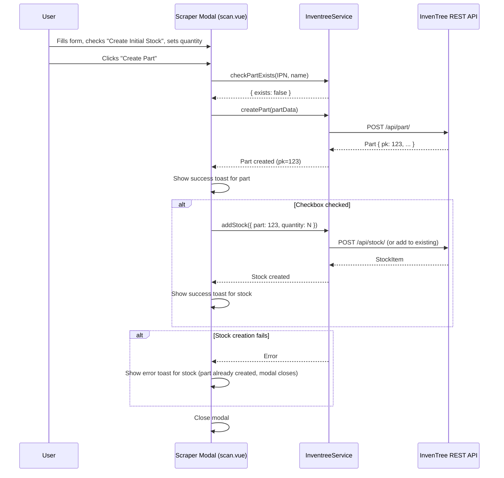

# Design Document: Initial Stock Quantity in Scraper Modal

## Overview

This design adds initial stock controls (checkbox + quantity input) to the Scraper Modal on the Scan Page (`/scan`), mirroring the pattern already established on the Create Part Page (`/create-part`). The change is scoped entirely to `app/pages/scan.vue` — no new components, composables, or services are needed.

The implementation touches three areas within `scan.vue`:

1. **UI controls** — a "Create Initial Stock" checkbox and a conditional numeric quantity input, placed below the existing form fields and above the modal footer buttons.
2. **Submit logic** — the `createPart` function gains a sequential stock-creation step: create part → (if checkbox checked) create stock via `InventreeService.addStock` → toast results.
3. **State reset** — the stock controls reset to defaults (unchecked, quantity 1) each time the modal opens with new scraped data.

No new files are created. The existing `InventreeService.addStock` method and `AddStockDto` type are reused as-is.

## Architecture



The flow is strictly sequential: part creation must succeed before stock creation is attempted. If part creation fails, no stock call is made. If stock creation fails, the part still exists and the modal closes (the part was already created successfully).

## Components and Interfaces

### Modified: `app/pages/scan.vue`

No new components are introduced. All changes are within the existing scan page file.

#### New Reactive State

```typescript
// Added alongside existing partForm ref
const createStock = ref(false)
const stockQuantity = ref(1)
```

These are standalone refs rather than properties on `partForm` because they are independent of the scraped data and follow a different lifecycle (reset on modal open, not populated from scrape response).

#### Auto-Focus Behavior

When the checkbox is checked and the quantity input becomes visible, the input should auto-focus and select its value. This uses a `nextTick` + template ref pattern:

```typescript
const stockQuantityInput = ref<HTMLInputElement | null>(null)

watch(createStock, async (checked) => {
  if (checked) {
    await nextTick()
    const input = stockQuantityInput.value
    if (input) {
      input.focus()
      input.select()
    }
  }
})
```

#### Modified `createPart` Function

The existing `createPart` function is extended with a stock creation step after successful part creation:

```typescript
const createPart = async () => {
  // ... existing part creation logic ...

  const response = await inventree.createPart(partData)

  toast.add({ title: 'Part created successfully', color: 'success' })

  // New: create initial stock if checkbox is checked
  if (createStock.value) {
    try {
      const stockData: AddStockDto = {
        part: response.pk,
        quantity: stockQuantity.value,
        notes: 'Initial stock created with part'
      }
      await inventree.addStock(stockData)
      toast.add({
        title: 'Initial stock added',
        description: `${stockQuantity.value} units`,
        color: 'success'
      })
    } catch (stockError) {
      const message = stockError instanceof Error ? stockError.message : 'Failed to add stock'
      toast.add({
        title: 'Failed to add initial stock',
        description: message,
        color: 'error'
      })
    }
  }

  isModalOpen.value = false
  // ... existing error handling ...
}
```

Key difference from the Create Part Page pattern: the modal close (`isModalOpen.value = false`) happens after both the part and stock operations complete (or fail), ensuring the user sees the result before the modal disappears.

#### State Reset on Modal Open

The `lookupProduct` function already sets `isModalOpen.value = true` when scraped data arrives. The stock controls are reset at the same point:

```typescript
// Inside lookupProduct, after setting partForm and before opening modal
createStock.value = false
stockQuantity.value = 1
isModalOpen.value = true
```

This ensures every modal open starts with a clean state regardless of what happened in the previous session.

#### Template Addition

The stock controls are added inside the modal's `#body` slot, below the existing form fields:

```vue
<!-- Initial Stock (inside modal #body, after Image URL field) -->
<USeparator label="Initial Stock" class="mt-4" />

<div class="space-y-3 mt-3">
  <div class="flex items-center gap-2">
    <UCheckbox v-model="createStock" />
    <div>
      <label class="text-sm font-medium">Create Initial Stock</label>
      <p class="text-xs text-gray-500">Add stock when creating this part</p>
    </div>
  </div>

  <UFormField v-if="createStock" label="Stock Quantity" description="Number of units to add">
    <UInput
      ref="stockQuantityInput"
      v-model.number="stockQuantity"
      type="number"
      min="1"
    />
  </UFormField>
</div>
```

This mirrors the exact pattern from `create-part.vue` — same component hierarchy, same labels, same layout.

## Data Models

### Existing Types (No Changes)

The feature reuses existing types without modification:

```typescript
// From app/types/inventree.ts — already exists
interface AddStockDto {
  part: number
  quantity: number
  location?: number | null
  notes?: string
}
```

### New Reactive State (scan.vue internal)

```typescript
// Not exported — local to scan.vue
const createStock: Ref<boolean>      // defaults to false
const stockQuantity: Ref<number>     // defaults to 1
```

### File Changes Summary

| File | Change |
|---|---|
| `app/pages/scan.vue` | Add stock controls UI, extend `createPart` logic, add state reset |

No new files. No type changes. No service changes.

## Correctness Properties

*A property is a characteristic or behavior that should hold true across all valid executions of a system — essentially, a formal statement about what the system should do. Properties serve as the bridge between human-readable specifications and machine-verifiable correctness guarantees.*

### Property 1: Quantity input visibility matches checkbox state

*For any* sequence of checkbox toggles (checked/unchecked), the quantity input field should be visible if and only if the "Create Initial Stock" checkbox is currently checked.

**Validates: Requirements 1.3, 1.4**

### Property 2: Quantity input rejects non-positive values

*For any* numeric value less than 1 (zero, negative numbers), the quantity input should constrain or reject the value, ensuring the submitted quantity is always a positive integer ≥ 1.

**Validates: Requirements 1.5**

### Property 3: addStock called if and only if checkbox checked and part creation succeeds

*For any* valid part form data and any checkbox state, `addStock` should be called exactly when the checkbox is checked AND `createPart` succeeds. If the checkbox is unchecked, `addStock` should never be called. If `createPart` fails, `addStock` should never be called regardless of checkbox state.

**Validates: Requirements 2.1, 2.5**

### Property 4: Successful stock creation passes correct quantity and shows toasts

*For any* positive integer quantity and valid part form data where both `createPart` and `addStock` succeed, `addStock` should receive the exact quantity from the input, and the system should display a part success toast and a stock success toast that includes the quantity value.

**Validates: Requirements 2.2, 2.3**

### Property 5: Stock controls reset on every modal open

*For any* sequence of modal interactions (open, modify controls, close/submit, open again), each time the modal opens with new scraped data, the checkbox should be unchecked and the quantity should be 1, regardless of what values were set during the previous modal session.

**Validates: Requirements 3.1, 3.2**

## Error Handling

| Error Condition | Behavior |
|---|---|
| Part creation fails (API error, duplicate IPN, network error) | Error toast shown, modal stays open, `addStock` is never called |
| Part succeeds but stock creation fails | Part success toast shown, stock error toast shown, modal closes (part already exists in InvenTree) |
| User enters quantity < 1 | HTML `min="1"` attribute on input prevents submission of values below 1; `v-model.number` ensures numeric type |
| User enters non-numeric quantity | `type="number"` on input prevents non-numeric entry; `v-model.number` coerces to number |

The error handling follows the same pattern as `create-part.vue`: the part creation is the critical path, and stock creation is a best-effort follow-up. If stock fails, the user can always add stock manually later via the Add Stock page.

## Testing Strategy

### Property-Based Testing

The project uses **fast-check** (`fast-check@^4.5.3`) with **vitest** (`vitest@^3.2.4`). All property tests use this existing setup.

Each correctness property maps to a single property-based test with a minimum of 100 iterations. Tests are tagged with comments referencing the design property:

```typescript
// Feature: initial-stock-quantity-scanner, Property 3: addStock called if and only if checkbox checked and part creation succeeds
```

**Key arbitraries (generators):**

| Arbitrary | Description |
|---|---|
| `quantityArb` | `fc.integer({ min: 1, max: 10000 })` — valid stock quantities |
| `invalidQuantityArb` | `fc.integer({ min: -1000, max: 0 })` — invalid quantities for rejection testing |
| `checkboxStateArb` | `fc.boolean()` — checked/unchecked state |
| `partPkArb` | `fc.integer({ min: 1, max: 100000 })` — simulated part primary keys |
| `partFormArb` | `fc.record({ name: fc.string({minLength:1}), IPN: fc.string({minLength:1}), description: fc.string(), link: fc.string(), image: fc.string() })` — random form data |
| `toggleSequenceArb` | `fc.array(fc.boolean(), { minLength: 1, maxLength: 20 })` — sequences of checkbox toggles for reset testing |

**Mocking strategy:**
- `useInventreeApi()` → mock returning a stub `InventreeService` with controllable `createPart` and `addStock` responses
- `useToast()` → mock `toast.add` to capture toast calls and verify titles/descriptions/colors
- `$fetch` → mock for the scrape endpoint to provide controlled scraped data
- DOM focus/select → spy on `HTMLInputElement.prototype.focus` and `HTMLInputElement.prototype.select`

### Unit Tests (Examples and Edge Cases)

Unit tests cover specific examples and edge cases that don't need property-based coverage:

**File:** `app/pages/__tests__/scan-stock.spec.ts`

- Checkbox defaults to unchecked when modal opens (Req 1.2 — example)
- Quantity input has default value of 1 when checkbox is first checked (Req 1.3 — example)
- Checking the checkbox auto-focuses and selects the quantity input (Req 1.6 — example)
- Stock controls are positioned below form fields and above action buttons (Req 1.1 — example)
- Part creation failure shows error toast and does not close modal (Req 2.5 — edge case)
- Part succeeds, stock fails: part toast shown, stock error toast shown, modal closes (Req 2.4 — edge case)
- Closing modal without submitting does not affect next open (Req 3.2 — edge case)

