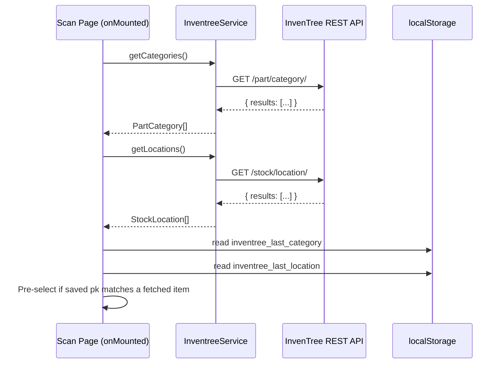
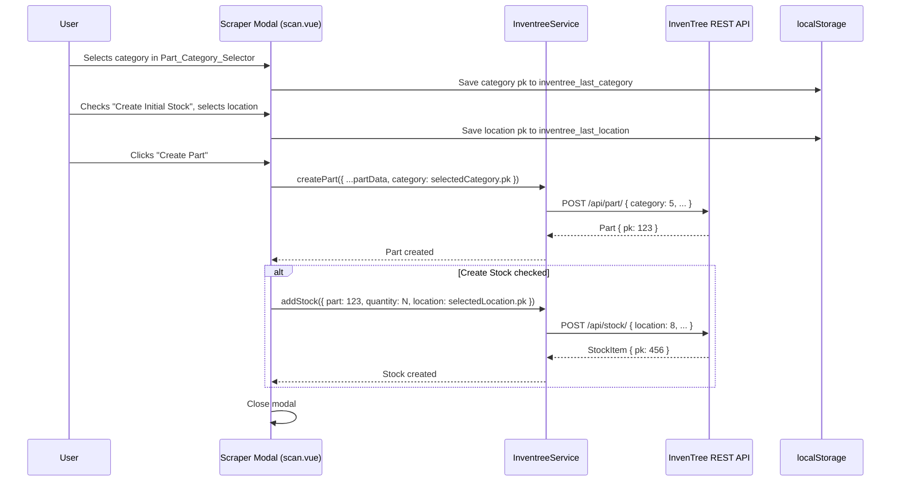

# Design Document: Part Category & Stock Location Selectors

## Overview

This design adds two searchable dropdown selectors to the Scraper Modal on the Scan Page (`/scan`):

1. A **Part Category** selector — displayed below the image preview in the left column, always visible when the modal is open.
2. A **Stock Location** selector — displayed inside the Initial Stock Controls section, visible only when "Create Initial Stock" is checked.

Both selectors use the Nuxt UI `USelectMenu` component with its `searchable` prop for type-to-filter functionality. Categories and locations are fetched once when the page loads (not on every modal open) via two new `InventreeService` methods: `getCategories()` and `getLocations()`. Selected values persist across sessions via localStorage (`inventree_last_category`, `inventree_last_location`), so the dropdowns default to the user's last selection on subsequent scans.

The implementation touches three files:

1. **`app/types/inventree.ts`** — Two new interfaces: `PartCategory` and `StockLocation`.
2. **`app/services/inventree.service.ts`** — Two new methods: `getCategories()` and `getLocations()`.
3. **`app/pages/scan.vue`** — New reactive state for selected category/location, localStorage read/write, fetch-on-load logic, template additions for both selectors, and wiring the selected values into `createPart`.

No new components or composables are created. The feature follows the same incremental extension pattern used by the initial-stock-quantity-scanner and barcode-link-stock specs.

## Architecture





Categories and locations are fetched once on page mount. The `lookupProduct` function does NOT re-fetch them — it only resets the selected values to the localStorage-persisted defaults. This avoids unnecessary API calls on every barcode scan.

## Components and Interfaces

### Modified: `app/types/inventree.ts`

Two new interfaces are added:

```typescript
export interface PartCategory {
  pk: number
  name: string
}

export interface StockLocation {
  pk: number
  name: string
}
```

These are minimal — only the fields needed for the dropdown display and value binding. The InvenTree API returns more fields, but we only use `pk` and `name`.

### Modified: `app/services/inventree.service.ts`

Two new methods on the existing `InventreeService` class:

```typescript
async getCategories(): Promise<PartCategory[]> {
  const response = await this.api('/part/category/')
  return Array.isArray(response) ? response : response?.results || []
}

async getLocations(): Promise<StockLocation[]> {
  const response = await this.api('/stock/location/')
  return Array.isArray(response) ? response : response?.results || []
}
```

Both follow the same paginated-response handling pattern used by `searchParts`, `getPartByIPN`, etc. — check if the response is an array directly or extract from `results`. Errors propagate to the caller (no try/catch wrapping).

### Modified: `app/pages/scan.vue`

#### New Reactive State

```typescript
const categories = ref<PartCategory[]>([])
const locations = ref<StockLocation[]>([])
const selectedCategory = ref<PartCategory | null>(null)
const selectedLocation = ref<StockLocation | null>(null)
```

#### Fetch on Page Load

Inside the existing `onMounted` hook:

```typescript
onMounted(async () => {
  // ... existing focus + history loading code ...

  const inventree = useInventreeApi()
  try {
    categories.value = await inventree.getCategories()
  } catch (e) {
    console.error('Failed to load categories:', e)
  }
  try {
    locations.value = await inventree.getLocations()
  } catch (e) {
    console.error('Failed to load locations:', e)
  }

  // Restore last selections from localStorage
  const savedCategoryPk = localStorage.getItem('inventree_last_category')
  if (savedCategoryPk) {
    const pk = Number(savedCategoryPk)
    const match = categories.value.find(c => c.pk === pk)
    if (match) selectedCategory.value = match
  }

  const savedLocationPk = localStorage.getItem('inventree_last_location')
  if (savedLocationPk) {
    const pk = Number(savedLocationPk)
    const match = locations.value.find(l => l.pk === pk)
    if (match) selectedLocation.value = match
  }
})
```

#### localStorage Persistence via Watchers

```typescript
watch(selectedCategory, (cat) => {
  if (cat) {
    localStorage.setItem('inventree_last_category', String(cat.pk))
  } else {
    localStorage.removeItem('inventree_last_category')
  }
})

watch(selectedLocation, (loc) => {
  if (loc) {
    localStorage.setItem('inventree_last_location', String(loc.pk))
  } else {
    localStorage.removeItem('inventree_last_location')
  }
})
```

#### Modified `lookupProduct` Function

The selected category and location are restored from localStorage defaults each time the modal opens (not cleared to null):

```typescript
const lookupProduct = async (barcode: string, index: number) => {
  // ... existing code ...
  if (response.success && response.data) {
    // ... existing form population ...
    createStock.value = false
    stockQuantity.value = 1
    currentBarcode.value = barcode
    linkBarcode.value = true

    // Restore selectors to localStorage defaults
    const savedCategoryPk = localStorage.getItem('inventree_last_category')
    if (savedCategoryPk) {
      const pk = Number(savedCategoryPk)
      selectedCategory.value = categories.value.find(c => c.pk === pk) || null
    } else {
      selectedCategory.value = null
    }

    const savedLocationPk = localStorage.getItem('inventree_last_location')
    if (savedLocationPk) {
      const pk = Number(savedLocationPk)
      selectedLocation.value = locations.value.find(l => l.pk === pk) || null
    } else {
      selectedLocation.value = null
    }

    isModalOpen.value = true
    toast.add({ title: 'Product found', color: 'success' })
  }
}
```

#### Modified `createPart` Function

The selected category pk is included in the `CreatePartDto`, and the selected location pk is included in the `AddStockDto`:

```typescript
const partData: CreatePartDto = {
  name: partForm.value.name,
  IPN: partForm.value.IPN,
  description: partForm.value.description,
  link: partForm.value.link,
  remote_image: partForm.value.image || '',
  category: selectedCategory.value?.pk ?? null
}

// ... inside the createStock block:
const stockData: AddStockDto = {
  part: response.pk,
  quantity: stockQuantity.value,
  location: selectedLocation.value?.pk ?? null,
  notes: 'Initial stock created with part'
}
```

#### Template Additions

Part Category Selector — below the image preview in the left column:

```vue
<!-- Inside the modal #body, left column, after the image preview -->
<div class="mt-4">
  <label class="block text-sm font-medium mb-1">Part Category</label>
  <USelectMenu
    v-model="selectedCategory"
    :items="categories"
    placeholder="Select category..."
    searchable
    option-attribute="name"
    value-attribute="pk"
    class="w-full"
  />
</div>
```

Stock Location Selector — inside the Initial Stock Controls, after the quantity input, before the link barcode checkbox:

```vue
<!-- Inside the createStock conditional block, after Stock Quantity UFormField -->
<UFormField v-if="createStock" label="Stock Location" description="Where to store the new stock">
  <USelectMenu
    v-model="selectedLocation"
    :items="locations"
    placeholder="Select location..."
    searchable
    option-attribute="name"
    value-attribute="pk"
    class="w-full"
  />
</UFormField>
```

## Data Models

### New Types (`app/types/inventree.ts`)

```typescript
export interface PartCategory {
  pk: number
  name: string
}

export interface StockLocation {
  pk: number
  name: string
}
```

### Existing Types Used (No Changes)

```typescript
// CreatePartDto already has category?: number | null
interface CreatePartDto {
  name: string
  IPN: string
  description?: string
  link?: string
  remote_image?: string
  category?: number | null  // ← used by this feature
  active?: boolean
  virtual?: boolean
}

// AddStockDto already has location?: number | null
interface AddStockDto {
  part: number
  quantity: number
  location?: number | null  // ← used by this feature
  notes?: string
}
```

### localStorage Keys

| Key | Value | Purpose |
|---|---|---|
| `inventree_last_category` | Category `pk` as string | Persist last selected part category |
| `inventree_last_location` | Location `pk` as string | Persist last selected stock location |

### New Reactive State (scan.vue internal)

```typescript
const categories: Ref<PartCategory[]>           // fetched on mount
const locations: Ref<StockLocation[]>            // fetched on mount
const selectedCategory: Ref<PartCategory | null> // bound to USelectMenu v-model
const selectedLocation: Ref<StockLocation | null> // bound to USelectMenu v-model
```

### File Changes Summary

| File | Change |
|---|---|
| `app/types/inventree.ts` | Add `PartCategory` and `StockLocation` interfaces |
| `app/services/inventree.service.ts` | Add `getCategories()` and `getLocations()` methods |
| `app/pages/scan.vue` | Add selector state, fetch on mount, localStorage persistence, template dropdowns, wire into createPart/addStock |


## Correctness Properties

*A property is a characteristic or behavior that should hold true across all valid executions of a system — essentially, a formal statement about what the system should do. Properties serve as the bridge between human-readable specifications and machine-verifiable correctness guarantees.*

### Property 1: Selected category pk (or null) is passed to CreatePartDto

*For any* optional part category (either a category with a valid pk or null), when the user submits the Scraper Modal form, the `category` field in the `CreatePartDto` should equal the selected category's `pk` if a category is selected, or `null` if no category is selected.

**Validates: Requirements 1.4, 1.5, 5.1, 5.3**

### Property 2: Location selector visibility matches createStock checkbox state

*For any* sequence of "Create Initial Stock" checkbox toggles (checked/unchecked), the Stock Location Selector should be visible if and only if the createStock checkbox is currently checked.

**Validates: Requirements 2.1, 2.2**

### Property 3: Selected location pk (or null) is passed to AddStockDto

*For any* optional stock location (either a location with a valid pk or null), when the user submits the form with "Create Initial Stock" checked, the `location` field in the `AddStockDto` should equal the selected location's `pk` if a location is selected, or `null` if no location is selected.

**Validates: Requirements 2.5, 2.6, 5.2, 5.4**

### Property 4: Category localStorage round-trip

*For any* list of part categories and any category selected from that list, saving the category pk to localStorage and then restoring it should produce the same selected category. If the saved pk does not match any category in the list, the selection should be null.

**Validates: Requirements 3.1, 3.3, 3.5**

### Property 5: Location localStorage round-trip

*For any* list of stock locations and any location selected from that list, saving the location pk to localStorage and then restoring it should produce the same selected location. If the saved pk does not match any location in the list, the selection should be null.

**Validates: Requirements 3.2, 3.4, 3.5**

### Property 6: Service methods extract results from paginated API responses

*For any* array of category or location objects, when the InvenTree API returns them in a paginated response (`{ results: [...] }`), `getCategories()` and `getLocations()` should return the same array. When the API returns a plain array, the methods should return it directly.

**Validates: Requirements 4.1, 4.2, 4.3, 4.4**

## Error Handling

| Error Condition | Behavior |
|---|---|
| `getCategories()` API call fails on page load | Error logged to console, `categories` remains empty array, Part Category Selector shows no options but modal still works (category will be null) |
| `getLocations()` API call fails on page load | Error logged to console, `locations` remains empty array, Stock Location Selector shows no options but modal still works (location will be null) |
| Saved category pk in localStorage doesn't match any fetched category | `selectedCategory` set to null, selector shows placeholder |
| Saved location pk in localStorage doesn't match any fetched location | `selectedLocation` set to null, selector shows placeholder |
| localStorage is unavailable (private browsing, storage full) | Graceful degradation — selectors work without persistence, default to null each session |
| Part creation fails | Same as existing behavior — error toast, modal stays open, no stock created |
| Part succeeds, stock creation fails with location | Same as existing behavior — part success toast, stock error toast, modal closes |

The error handling follows the existing pattern: API fetch failures for categories/locations are non-fatal (logged, not thrown), and the selectors gracefully degrade to "no selection" when data is unavailable.

## Testing Strategy

### Property-Based Testing

The project uses **fast-check** (`fast-check@^4.5.3`) with **vitest** (`vitest@^3.2.4`). All property tests use this existing setup.

Each correctness property maps to a single property-based test with a minimum of 100 iterations. Tests are tagged with comments referencing the design property:

```typescript
// Feature: part-stock-location-selector, Property 1: Selected category pk (or null) is passed to CreatePartDto
```

**Key arbitraries (generators):**

| Arbitrary | Description |
|---|---|
| `categoryArb` | `fc.record({ pk: fc.integer({ min: 1, max: 100000 }), name: fc.string({ minLength: 1, maxLength: 100 }) })` — random part categories |
| `locationArb` | `fc.record({ pk: fc.integer({ min: 1, max: 100000 }), name: fc.string({ minLength: 1, maxLength: 100 }) })` — random stock locations |
| `optionalCategoryArb` | `fc.option(categoryArb, { nil: null })` — category or null |
| `optionalLocationArb` | `fc.option(locationArb, { nil: null })` — location or null |
| `categoryListArb` | `fc.array(categoryArb, { minLength: 1, maxLength: 50 })` — list of categories for round-trip testing |
| `locationListArb` | `fc.array(locationArb, { minLength: 1, maxLength: 50 })` — list of locations for round-trip testing |
| `toggleSequenceArb` | `fc.array(fc.boolean(), { minLength: 1, maxLength: 20 })` — checkbox toggle sequences |
| `invalidPkArb` | `fc.integer({ min: -1000, max: 0 })` — pks that won't match any valid item |

**Test file:** `app/pages/__tests__/scan-category-location.spec.ts`

**Testing approach:** Following the existing pattern in `scan-stock.spec.ts` and `scan-barcode-link.spec.ts`:
- Property tests simulate reactive state logic (not mounting Vue components)
- Unit tests verify source code structure by reading `scan.vue` and `inventree.service.ts`
- Service tests instantiate `InventreeService` with a mock API function

### Unit Tests (Examples and Edge Cases)

Unit tests cover specific examples and edge cases that don't need property-based coverage:

- `scan.vue` declares `categories`, `locations`, `selectedCategory`, `selectedLocation` refs (Req 1.3, 2.4 — example)
- `scan.vue` template contains `USelectMenu` with `searchable` prop for category selector (Req 1.2 — example)
- `scan.vue` template contains `USelectMenu` with `searchable` prop for location selector inside `v-if="createStock"` (Req 2.3 — example)
- `getCategories` calls `/part/category/` endpoint (Req 4.3 — example)
- `getLocations` calls `/stock/location/` endpoint (Req 4.4 — example)
- `getCategories`/`getLocations` propagate API errors (Req 4.5 — edge case)
- Saved pk that doesn't match any fetched item results in null selection (Req 3.5 — edge case)
