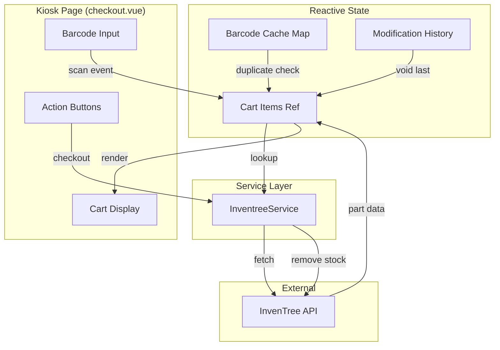

# Design Document: Self-Checkout Kiosk

## Overview

The self-checkout kiosk feature provides a streamlined interface for warehouse operators to scan items and remove them from inventory stock. The page is optimized for USB barcode scanner input with immediate visual feedback, lazy-loaded item details, and a cart-based workflow where stock is only deducted upon explicit checkout.

The design leverages the existing InvenTree service layer and NuxtUI component library, following patterns established in the existing `scan.vue` and `add-stock.vue` pages.

## Architecture



### Component Structure

The feature consists of a single page component with internal composable logic:

1. **checkout.vue** - Main page component handling UI rendering and user interactions
2. **useCheckoutCart** - Composable managing cart state, barcode caching, and modification history
3. **InventreeService** - Existing service for API communication (extended if needed)

## Components and Interfaces

### Cart Item Interface

```typescript
interface CartItem {
  id: string                    // Unique identifier (UUID)
  barcode: string               // Scanned barcode string
  quantity: number              // Quantity in cart
  status: 'loading' | 'loaded' | 'error'
  part?: Part                   // Loaded part data (from InvenTree)
  errorMessage?: string         // Error message if lookup failed
  addedAt: number               // Timestamp for modification tracking
  lastModifiedAt: number        // Timestamp of last quantity change
}
```

### Checkout Cart Composable

```typescript
interface UseCheckoutCart {
  // State
  cartItems: Ref<CartItem[]>
  isCheckingOut: Ref<boolean>
  
  // Actions
  addOrIncrementItem(barcode: string): void
  updateQuantity(itemId: string, quantity: number): void
  removeItem(itemId: string): void
  voidLastItem(): CartItem | null
  clearCart(): void
  checkout(): Promise<CheckoutResult>
  
  // Computed
  hasErrors: ComputedRef<boolean>
  isEmpty: ComputedRef<boolean>
  totalItems: ComputedRef<number>
}

interface CheckoutResult {
  success: boolean
  processedItems: number
  failedItems: CartItem[]
  message: string
}
```

### Page Component Structure

```vue
<template>
  <div class="checkout-kiosk">
    <!-- Header with title and hotkey hints -->
    <header>...</header>
    
    <!-- Barcode input section -->
    <section class="scanner-input">
      <UInput v-model="barcodeInput" @keyup.enter="handleScan" />
    </section>
    
    <!-- Cart items list -->
    <section class="cart-items">
      <CartItemCard 
        v-for="item in cartItems" 
        :key="item.id"
        :item="item"
        @update-quantity="updateQuantity"
        @remove="removeItem"
      />
    </section>
    
    <!-- Action buttons -->
    <section class="cart-actions">
      <UButton @click="voidLastItem">Void Last [Esc]</UButton>
      <UButton @click="clearCart">Clear Cart</UButton>
      <UButton @click="checkout" :disabled="hasErrors || isEmpty">
        Checkout [Enter]
      </UButton>
    </section>
  </div>
</template>
```

## Data Models

### Cart State Model

```typescript
// Internal state managed by useCheckoutCart composable
interface CartState {
  items: Map<string, CartItem>      // Keyed by item ID
  barcodeIndex: Map<string, string> // barcode -> itemId for quick lookup
  modificationOrder: string[]       // Stack of item IDs in modification order
}
```

### Part Lookup Response

Uses existing `Part` interface from `~/types/inventree.ts`:

```typescript
interface Part {
  pk: number
  name: string
  description: string
  IPN: string
  in_stock: number
  image: string | null
  thumbnail: string | null
  // ... other fields
}
```

### Stock Removal Request

Uses existing `RemoveStockDto` from `~/types/inventree.ts`:

```typescript
interface RemoveStockDto {
  quantity: number
  notes?: string
}
```

### Checkout Transaction Model

```typescript
interface CheckoutTransaction {
  items: Array<{
    cartItemId: string
    partPk: number
    quantity: number
    stockItemPk: number
  }>
  timestamp: Date
  status: 'pending' | 'processing' | 'completed' | 'partial' | 'failed'
  results: Array<{
    cartItemId: string
    success: boolean
    error?: string
  }>
}
```


## Correctness Properties

*A property is a characteristic or behavior that should hold true across all valid executions of a system—essentially, a formal statement about what the system should do. Properties serve as the bridge between human-readable specifications and machine-verifiable correctness guarantees.*

### Property 1: Adding item adds to cart and clears input

*For any* valid barcode string, when scanned (entered and submitted), the cart should contain an item with that barcode AND the input field should be empty.

**Validates: Requirements 2.1, 2.6**

### Property 2: Duplicate barcode increments quantity

*For any* barcode string scanned N times (where N > 1), the cart should contain exactly one item with that barcode and quantity equal to N.

**Validates: Requirements 2.3**

### Property 3: Barcode cache prevents duplicate lookups

*For any* barcode that has been scanned once and is in the cart, subsequent scans of the same barcode should not trigger additional API lookup calls.

**Validates: Requirements 2.5**

### Property 4: Quantity increment is immediate

*For any* barcode already in the cart, when scanned again, the displayed quantity should increment immediately (before any async operation completes).

**Validates: Requirements 2.4**

### Property 5: Failed lookup sets error state

*For any* barcode where the part lookup fails or returns no results, the cart item should have status 'error', display the original barcode string, and show an error message.

**Validates: Requirements 3.2, 3.3**

### Property 6: Error items reject quantity updates

*For any* cart item in error state, attempts to modify the quantity should be rejected and the quantity should remain unchanged.

**Validates: Requirements 3.4**

### Property 7: Loaded item displays required fields

*For any* cart item with status 'loaded', the rendered display should include the part name, part image (or placeholder), stock quantity, and cart quantity.

**Validates: Requirements 3.1, 4.1**

### Property 8: Quantity update is immediate

*For any* cart item with status 'loaded' and any valid quantity value, updating the quantity should immediately reflect in the cart item state.

**Validates: Requirements 4.4**

### Property 9: Remove item clears from cart and cache

*For any* cart item, when removed, the item should no longer exist in the cart AND the barcode should no longer be in the cache (allowing it to be scanned as new).

**Validates: Requirements 4.6**

### Property 10: Clear cart removes all items and clears cache

*For any* cart with N items (N >= 0), after clearing, the cart should be empty AND all previously scanned barcodes should be treated as new (not in cache).

**Validates: Requirements 5.1, 5.2**

### Property 11: Checkout blocked with error items

*For any* cart containing at least one item with status 'error', the checkout operation should be prevented and return a validation failure.

**Validates: Requirements 5.5**

### Property 12: Checkout removes stock for all valid items

*For any* cart with N valid items (status 'loaded'), when checkout succeeds, stock removal should be called for each item with the correct quantity.

**Validates: Requirements 6.1**

### Property 13: Successful checkout clears cart

*For any* cart where all stock removals succeed, after checkout completes, the cart should be empty.

**Validates: Requirements 6.4**

### Property 14: Checkout blocked when quantity exceeds stock

*For any* cart item where cart quantity exceeds the part's available stock, checkout should be prevented and the item should be flagged with a warning.

**Validates: Requirements 6.6**

### Property 15: Void removes most recently modified item

*For any* non-empty cart, when void is triggered, the item with the most recent modification timestamp should be removed from the cart.

**Validates: Requirements 7.1**

### Property 16: Modification order is tracked correctly

*For any* sequence of cart operations (add, update quantity), the modification order should reflect the chronological order of the most recent change to each item.

**Validates: Requirements 7.4**

### Property 17: Focus returns to input after operations

*For any* cart operation (add, remove, update, void, clear), after the operation completes, the barcode input field should have focus.

**Validates: Requirements 8.1**

## Error Handling

### Part Lookup Errors

| Error Condition | Handling |
|----------------|----------|
| Network failure | Set cart item status to 'error', display "Network error - unable to lookup part" |
| Part not found (empty results) | Set cart item status to 'error', display "Part not found for barcode: {barcode}" |
| API error (4xx/5xx) | Set cart item status to 'error', display API error message |
| Timeout | Set cart item status to 'error', display "Lookup timed out" |

### Checkout Errors

| Error Condition | Handling |
|----------------|----------|
| Cart is empty | Display warning toast, prevent checkout |
| Cart has error items | Display warning toast listing error items, prevent checkout |
| Quantity exceeds stock | Display warning on affected items, prevent checkout |
| Stock removal fails | Mark item as failed in results, continue with remaining items, show partial success |
| Network failure during checkout | Display error toast, keep cart intact for retry |
| All removals fail | Display error toast, keep cart intact for retry |

### Input Validation

| Validation | Handling |
|------------|----------|
| Empty barcode input | Ignore, do not add to cart |
| Whitespace-only barcode | Trim and ignore if empty |
| Quantity <= 0 | Reject update, keep previous quantity |
| Non-numeric quantity | Reject update, keep previous quantity |

## Testing Strategy

### Unit Tests

Unit tests should cover specific examples and edge cases:

1. **Page Structure Tests**
   - Homepage contains link to checkout page
   - Checkout page renders input, cart, and action buttons
   - Buttons display hotkey hints

2. **Edge Case Tests**
   - Void on empty cart does nothing
   - Checkout on empty cart shows warning
   - Clear on empty cart succeeds without error

3. **Integration Tests**
   - Part lookup integrates with InventreeService
   - Stock removal integrates with InventreeService

### Property-Based Tests

Property-based tests should use a library like `fast-check` for TypeScript/JavaScript. Each test should run a minimum of 100 iterations.

**Test Configuration:**
```typescript
import fc from 'fast-check'

// Arbitrary for valid barcode strings
const barcodeArb = fc.string({ minLength: 1, maxLength: 50 })
  .filter(s => s.trim().length > 0)

// Arbitrary for cart items
const cartItemArb = fc.record({
  barcode: barcodeArb,
  quantity: fc.integer({ min: 1, max: 100 })
})
```

**Property Test Mapping:**

| Property | Test Tag |
|----------|----------|
| Property 1 | Feature: self-checkout-kiosk, Property 1: Adding item adds to cart and clears input |
| Property 2 | Feature: self-checkout-kiosk, Property 2: Duplicate barcode increments quantity |
| Property 3 | Feature: self-checkout-kiosk, Property 3: Barcode cache prevents duplicate lookups |
| Property 5 | Feature: self-checkout-kiosk, Property 5: Failed lookup sets error state |
| Property 6 | Feature: self-checkout-kiosk, Property 6: Error items reject quantity updates |
| Property 8 | Feature: self-checkout-kiosk, Property 8: Quantity update is immediate |
| Property 9 | Feature: self-checkout-kiosk, Property 9: Remove item clears from cart and cache |
| Property 10 | Feature: self-checkout-kiosk, Property 10: Clear cart removes all items and clears cache |
| Property 11 | Feature: self-checkout-kiosk, Property 11: Checkout blocked with error items |
| Property 15 | Feature: self-checkout-kiosk, Property 15: Void removes most recently modified item |
| Property 16 | Feature: self-checkout-kiosk, Property 16: Modification order is tracked correctly |

**Note:** Properties 4, 7, 12, 13, 14, 17 involve UI rendering or async timing that are better suited for integration/e2e tests rather than pure property-based unit tests.

### Test File Structure

```
app/
├── composables/
│   └── __tests__/
│       └── useCheckoutCart.spec.ts    # Property tests for cart logic
├── pages/
│   └── __tests__/
│       └── checkout.spec.ts           # Component tests
```
