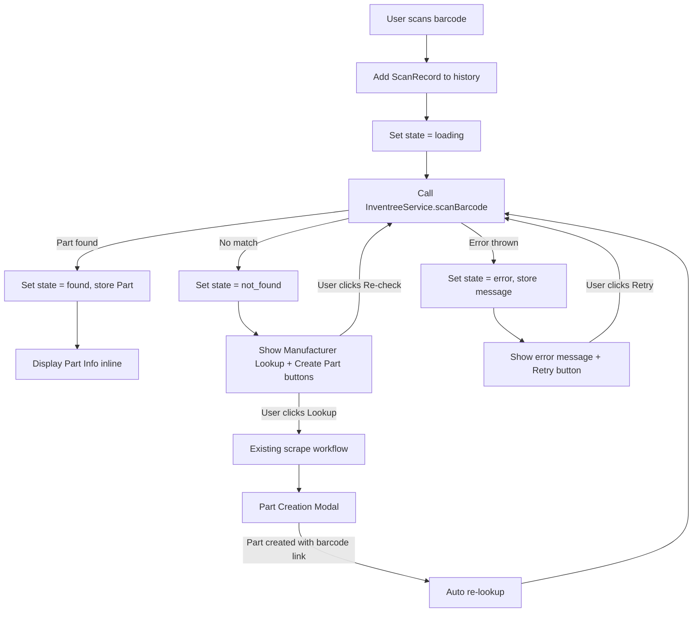

# Design Document: Smart Barcode Lookup

## Overview

This feature enhances the existing scanner page (`/scan`) to automatically look up scanned barcodes against the InvenTree inventory system. Currently, the scanner page captures barcodes and offers a manual "Lookup" button that scrapes manufacturer websites. With this change, every scanned barcode will immediately trigger an InvenTree barcode lookup via `InventreeService.scanBarcode()`. If the barcode resolves to a known part, the scan record displays part details inline (name, IPN, description, image, stock level, link) — similar to how the checkout page renders resolved cart items. If the barcode is unrecognized, the existing manufacturer lookup and part creation workflows remain available.

Each scan record gains a state machine (`loading` → `found` | `not_found` | `error`) that drives visual styling and available actions. The full scan history, including lookup state and resolved part data, is persisted to `localStorage`.

## Architecture

The feature is contained entirely within the frontend. No new server endpoints are needed — the existing `InventreeService.scanBarcode()` method already handles the barcode-to-part resolution, and the scraping endpoints (`/api/scrape-hoffmann`, `/api/scrape-sandvik`) remain unchanged.



### Key Design Decisions

1. **Extend `ScanRecord` in-place** rather than creating a separate composable. The scan page already manages `scanHistory` as a `ref<ScanRecord[]>`. Adding lookup state fields (`lookupStatus`, `part`, `errorMessage`) to `ScanRecord` keeps the data model flat and avoids synchronization between two reactive stores. This mirrors how `useCheckoutCart` manages `CartItem` with inline `status`/`part`/`errorMessage` fields.

2. **Extract a `useScanLookup` composable** to encapsulate the lookup logic (call `scanBarcode`, update record state, handle errors). This keeps `scan.vue` focused on template/UI concerns and makes the lookup logic independently testable — the same pattern used by `useCheckoutCart`.

3. **Reuse the checkout page's part display pattern** (image with `resolveImageUrl`, part name, stock level, barcode) rather than creating a new component. The display is simple enough to inline in the scan history list template.

4. **Persist full lookup state to localStorage** by extending the existing `scanHistory` watcher. The `Part` object and `lookupStatus` are serialized alongside barcode/timestamp. On page load, records with `found` status restore their part data; records with `loading` status are re-triggered.


## Components and Interfaces

### 1. `useScanLookup` Composable

New composable at `app/composables/useScanLookup.ts` that encapsulates barcode lookup logic.

```typescript
interface UseScanLookup {
  /**
   * Perform a barcode lookup for a scan record.
   * Sets record to 'loading', calls scanBarcode, then updates to 'found'/'not_found'/'error'.
   */
  lookupBarcode(record: ScanRecord, scanHistory: Ref<ScanRecord[]>): Promise<void>

  /**
   * Re-lookup a barcode (retry after error, re-check after not_found, or auto re-lookup after part creation).
   */
  reLookupBarcode(record: ScanRecord, scanHistory: Ref<ScanRecord[]>): Promise<void>
}
```

The composable internally calls `useInventreeApi()` to get the `InventreeService` instance. Both `lookupBarcode` and `reLookupBarcode` share the same core logic — set `loading`, call `scanBarcode`, branch on result.

### 2. Extended `ScanRecord` Interface

Updated in `app/types/scanner.ts`:

```typescript
interface ScanRecord {
  barcode: string
  type?: string
  timestamp: Date
  // New fields for smart lookup:
  lookupStatus: 'loading' | 'found' | 'not_found' | 'error'
  part?: Part          // Populated when lookupStatus === 'found'
  errorMessage?: string // Populated when lookupStatus === 'error'
}
```

The existing `loading?: boolean` field is replaced by the `lookupStatus` enum, which provides richer state information.

### 3. Updated `scan.vue` Page

Changes to the scanner page template:

- **Scan history items**: Each `ScanRecord` renders differently based on `lookupStatus`:
  - `loading`: Spinner icon + barcode text (replaces the old `scan.loading` boolean)
  - `found`: Part info display (image, name, IPN, description, stock, link) + green "Found" badge. Manufacturer Lookup button is hidden.
  - `not_found`: Amber "Not Found" badge + Manufacturer Lookup button + "Create Part" button + "Re-check" button
  - `error`: Red "Error" badge + error message + "Retry" button
- **`handleScan`**: After pushing a new `ScanRecord`, immediately calls `useScanLookup.lookupBarcode()`.
- **`handleBarcodeDetected`**: Same — after pushing the camera-detected record, triggers lookup.
- **Part creation callback**: When `isModalOpen` closes after successful creation with `linkBarcode` enabled, calls `reLookupBarcode` on the corresponding record.

### 4. `resolveImageUrl` Helper

Extract the existing `resolveImageUrl` function from `checkout.vue` into a shared utility (or duplicate inline in `scan.vue` since it's a 4-line function). This resolves relative InvenTree image paths to absolute URLs using `runtimeConfig.public.inventreeApiUrl`.

## Data Models

### ScanRecord (Extended)

| Field | Type | Description |
|-------|------|-------------|
| `barcode` | `string` | The scanned barcode value |
| `type` | `string?` | Barcode type label (e.g., "1D - EAN-13") |
| `timestamp` | `Date` | When the barcode was scanned |
| `lookupStatus` | `'loading' \| 'found' \| 'not_found' \| 'error'` | Current lookup state |
| `part` | `Part?` | Resolved part data from InvenTree (when `found`) |
| `errorMessage` | `string?` | Error description (when `error`) |

### Part (Existing, unchanged)

| Field | Type | Description |
|-------|------|-------------|
| `pk` | `number` | Primary key |
| `name` | `string` | Part name |
| `IPN` | `string` | Internal Part Number |
| `description` | `string` | Part description |
| `in_stock` | `number` | Current stock level |
| `image` | `string?` | Full image URL |
| `thumbnail` | `string?` | Thumbnail URL |
| `link` | `string` | External link |

### localStorage Schema

The existing `scanHistory` key stores `ScanRecord[]` serialized as JSON. The schema extends to include the new fields:

```json
[
  {
    "barcode": "4066474000123",
    "type": "1D - EAN-13",
    "timestamp": "2025-01-15T10:30:00.000Z",
    "lookupStatus": "found",
    "part": { "pk": 42, "name": "Drill Bit 8mm", "IPN": "DB-008", ... }
  },
  {
    "barcode": "9999999999999",
    "timestamp": "2025-01-15T10:31:00.000Z",
    "lookupStatus": "not_found"
  }
]
```

On page load, records with `lookupStatus === 'loading'` are re-triggered (the lookup was interrupted by a page refresh). Records with `found` restore their `part` data. Records with `not_found` or `error` retain their state.


## Correctness Properties

*A property is a characteristic or behavior that should hold true across all valid executions of a system — essentially, a formal statement about what the system should do. Properties serve as the bridge between human-readable specifications and machine-verifiable correctness guarantees.*

### Property 1: Lookup initiation on scan

*For any* valid barcode string added to the scan history, the corresponding `ScanRecord` should immediately have `lookupStatus === 'loading'` and `InventreeService.scanBarcode` should be called with that barcode value.

**Validates: Requirements 1.1, 1.2**

### Property 2: Found state transition

*For any* barcode where `InventreeService.scanBarcode` returns a `Part` object, the corresponding `ScanRecord` should transition to `lookupStatus === 'found'` and its `part` field should contain the returned `Part` data.

**Validates: Requirements 1.3, 6.2**

### Property 3: Not-found state transition

*For any* barcode where `InventreeService.scanBarcode` returns `null`, the corresponding `ScanRecord` should transition to `lookupStatus === 'not_found'` with no `part` data.

**Validates: Requirements 1.4**

### Property 4: Error state transition

*For any* barcode where `InventreeService.scanBarcode` throws an error, the corresponding `ScanRecord` should transition to `lookupStatus === 'error'` and its `errorMessage` should contain the thrown error's message.

**Validates: Requirements 1.5**


### Property 5: State invariant

*For any* `ScanRecord` in the scan history at any point in time, its `lookupStatus` field must be exactly one of `'loading'`, `'found'`, `'not_found'`, or `'error'`.

**Validates: Requirements 4.1**

### Property 6: Found record UI rendering

*For any* `ScanRecord` with `lookupStatus === 'found'`, the rendered output should include the part name, IPN, description, stock level, and link; should display a "Found" badge; should apply a green visual style; and should not render the Manufacturer Lookup button.

**Validates: Requirements 2.1, 2.3, 2.4, 4.3**

### Property 7: Not-found record UI rendering

*For any* `ScanRecord` with `lookupStatus === 'not_found'`, the rendered output should display a "Not Found" badge, the Manufacturer Lookup button, a "Create Part" button, a "Re-check" button, and apply an amber/neutral visual style.

**Validates: Requirements 3.1, 3.2, 3.3, 4.4, 5.3**

### Property 8: Error record UI rendering

*For any* `ScanRecord` with `lookupStatus === 'error'`, the rendered output should display an error badge, the error message text, a "Retry" button, and apply a red visual style.

**Validates: Requirements 4.5, 5.1**


### Property 9: Re-lookup resets state and re-calls API

*For any* `ScanRecord` with `lookupStatus === 'error'` or `'not_found'`, invoking re-lookup should reset `lookupStatus` to `'loading'`, clear any previous `errorMessage`, and call `InventreeService.scanBarcode` with the record's barcode.

**Validates: Requirements 5.2, 5.4**

### Property 10: localStorage round-trip persistence

*For any* scan history containing records in various states (`found` with part data, `not_found`, `error` with messages), serializing to JSON and deserializing should produce an equivalent scan history with all `lookupStatus`, `part`, and `errorMessage` fields preserved.

**Validates: Requirements 4.6**

## Error Handling

| Scenario | Behavior |
|----------|----------|
| `scanBarcode` returns `null` | Record transitions to `not_found`. User sees amber badge + lookup/create buttons. |
| `scanBarcode` throws (network error, 500, timeout) | Record transitions to `error`. Error message displayed. Retry button available. |
| `scanBarcode` throws with non-Error object | Record transitions to `error` with generic message "Failed to look up barcode". |
| Page refresh during `loading` state | On reload, records with `lookupStatus === 'loading'` are re-triggered automatically. |
| InvenTree API not configured (no URL/token) | `scanBarcode` will fail on first call. Error state shown with descriptive message. |
| Part creation succeeds but re-lookup fails | Record transitions to `error` after the re-lookup attempt. Retry button available. |
| localStorage corrupted or missing | Graceful fallback: empty scan history, same as current behavior. |


## Testing Strategy

### Testing Framework

- **Unit/Property tests**: Vitest + fast-check (already used in the project, see `useCheckoutCart.spec.ts`)
- **Component tests**: Vitest + `@vue/test-utils` for Vue component rendering assertions

### Property-Based Tests

Each correctness property is implemented as a single property-based test using `fast-check`. Each test runs a minimum of 100 iterations.

Tests are tagged with comments referencing the design property:
```
// Feature: smart-barcode-lookup, Property 1: Lookup initiation on scan
```

**Properties 1–5, 9** are tested against the `useScanLookup` composable with a mocked `InventreeService`. Random barcode strings and random Part objects are generated via fast-check arbitraries.

**Property 10** is tested by generating random `ScanRecord[]` arrays, serializing to JSON, deserializing, and asserting equivalence (round-trip property).

**Properties 6–8** are tested as component-level property tests: generate random `ScanRecord` objects in each state, render the scan history item, and assert the presence/absence of expected DOM elements and CSS classes.

### Unit Tests

Unit tests complement property tests for specific examples and edge cases:

- **Integration example**: Camera scan detection → `handleBarcodeDetected` → lookup triggered (Req 1.1)
- **Edge case**: Barcode with leading/trailing whitespace is trimmed before lookup
- **Edge case**: Part with `image: null` and `thumbnail: null` shows fallback icon (Req 2.2)
- **Integration example**: Manufacturer lookup button click triggers scrape workflow (Req 3.4)
- **Integration example**: Part creation with `linkBarcode` enabled triggers auto re-lookup (Req 6.1)
- **Edge case**: Part creation without `linkBarcode` does not trigger re-lookup
- **Edge case**: Multiple rapid scans each get independent lookups

### Test File Locations

- `app/composables/__tests__/useScanLookup.spec.ts` — Property tests for Properties 1–5, 9
- `app/types/__tests__/scanRecord.spec.ts` — Property test for Property 10 (round-trip)
- `app/pages/__tests__/scan.spec.ts` — Component tests for Properties 6–8, plus unit/integration tests
