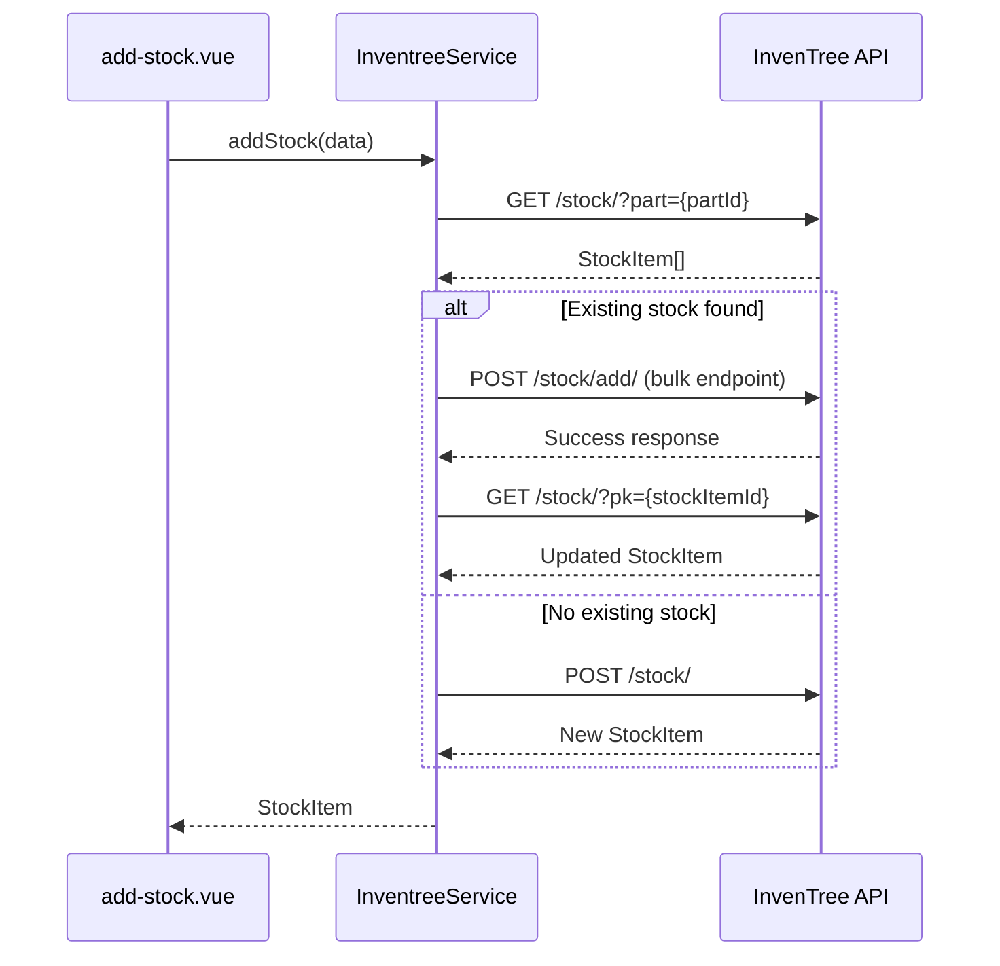

# Design Document: Smart Stock Addition

## Overview

This design describes the implementation of smart stock addition functionality for the InvenTree webapp. The core change transforms the `addStock` method from always creating new stock items to intelligently consolidating stock by adding to existing items when available.

The solution follows a "check-then-act" pattern: query for existing stock items, and either add to an existing item or create a new one based on the query results.

## Architecture

The implementation modifies the existing service layer without changing the overall architecture:



### Key Design Decisions

1. **First-item selection**: When multiple stock items exist, the system adds to the first item returned. This is consistent with the existing `removeStock` implementation.

2. **Service-layer logic**: The consolidation logic lives in `InventreeService`, keeping the UI layer unchanged and maintaining separation of concerns.

3. **Fail-fast on query errors**: If the initial stock query fails, the operation aborts rather than falling back to creating a new item.

## Components and Interfaces

### Modified Component: InventreeService

**File**: `app/services/inventree.service.ts`

```typescript
// New method for adding to existing stock
async addToExistingStock(stockItemId: number, data: AddToExistingStockDto): Promise<StockItem> {
  // InvenTree uses a bulk endpoint: POST /stock/add/ with items array
  const response = await this.api('/stock/add/', {
    method: 'POST',
    body: {
      items: [
        {
          pk: stockItemId,
          quantity: data.quantity
        }
      ],
      notes: data.notes || ''
    }
  })
  
  // The bulk endpoint returns success status, so we need to fetch the updated stock item
  const updatedItems = await this.api(`/stock/?pk=${stockItemId}`)
  const items = Array.isArray(updatedItems) ? updatedItems : updatedItems?.results || []
  if (items.length === 0) {
    throw new Error('Failed to retrieve updated stock item')
  }
  return items[0]
}

// Modified addStock method with consolidation logic
async addStock(data: AddStockDto): Promise<StockItem> {
  // 1. Check for existing stock items
  const existingItems = await this.getStockItems(data.part)
  
  // 2. If existing stock found, add to first item
  if (existingItems.length > 0) {
    const firstItem = existingItems[0]
    return await this.addToExistingStock(firstItem.pk, {
      quantity: data.quantity,
      notes: data.notes
    })
  }
  
  // 3. Otherwise, create new stock item
  return await this.api('/stock/', {
    method: 'POST',
    body: data
  })
}
```

### Interface Changes

No changes to the public interface of `addStock`. The method signature remains:
```typescript
addStock(data: AddStockDto): Promise<StockItem>
```

This ensures backward compatibility with the UI layer.

## Data Models

### New Type: AddToExistingStockDto

**File**: `app/types/inventree.ts`

```typescript
export interface AddToExistingStockDto {
  quantity: number
  notes?: string
}
```

This DTO matches the InvenTree API's expected payload for the `POST /stock/{id}/add/` endpoint.

### Existing Types (Unchanged)

- `AddStockDto`: Used for creating new stock items, remains unchanged
- `StockItem`: Return type for stock operations, remains unchanged
- `Part`: Part information, remains unchanged


## Correctness Properties

*A property is a characteristic or behavior that should hold true across all valid executions of a system—essentially, a formal statement about what the system should do. Properties serve as the bridge between human-readable specifications and machine-verifiable correctness guarantees.*

### Property 1: Stock Consolidation Routing

*For any* `addStock` call with a valid part ID and quantity, the service SHALL first query existing stock items, then either:
- Add to the first existing stock item if any exist, OR
- Create a new stock item if none exist

This property ensures the core consolidation logic works correctly across all scenarios.

**Validates: Requirements 1.1, 2.1, 3.1**

### Property 2: Query Error Propagation

*For any* `addStock` call where the initial `getStockItems` query fails, the service SHALL propagate the error without calling any stock creation or addition endpoints.

This ensures fail-fast behavior and prevents partial operations.

**Validates: Requirements 1.3**

### Property 3: Add-to-Existing Error Propagation

*For any* `addStock` call where existing stock is found but the `addToExistingStock` operation fails, the service SHALL propagate the error with a descriptive message.

**Validates: Requirements 2.4**

### Property 4: Return Value Consistency

*For any* successful `addStock` call, the service SHALL return a `StockItem` object that matches the response from the underlying API operation (either add-to-existing or create-new).

**Validates: Requirements 2.3, 3.3**

### Property 5: Payload Integrity for New Stock Creation

*For any* `addStock` call that results in creating a new stock item, the payload sent to the API SHALL include the part ID, quantity, and notes from the input `AddStockDto`.

**Validates: Requirements 3.2**

## Error Handling

### Error Scenarios

| Scenario | Behavior | User Message |
|----------|----------|--------------|
| Stock query fails (network/API error) | Propagate error, abort operation | "Failed to check existing stock" |
| Add-to-existing fails | Propagate error | "Failed to add stock to existing item" |
| Create-new fails | Propagate error | "Failed to create stock item" |
| Invalid quantity (≤ 0) | Reject at service layer | "Quantity must be positive" |

### Error Propagation Strategy

The service layer propagates errors to the UI layer, which handles user notification via toast messages. This maintains the existing error handling pattern in the codebase.

```typescript
// Errors bubble up naturally through async/await
try {
  await inventree.addStock(stockData)
} catch (error) {
  // UI handles error display
  toast.add({ title: 'Failed to add stock', description: error.message, color: 'error' })
}
```

## Testing Strategy

### Unit Tests

Unit tests verify specific examples and edge cases:

1. **Existing stock scenario**: Mock `getStockItems` to return items, verify `addToExistingStock` is called with correct parameters
2. **No existing stock scenario**: Mock `getStockItems` to return empty array, verify `POST /stock/` is called
3. **Query error scenario**: Mock `getStockItems` to throw, verify error propagates and no creation occurs
4. **Add-to-existing error scenario**: Mock successful query but failed add, verify error propagates

### Property-Based Tests

Property-based tests use `fast-check` to verify universal properties across generated inputs:

- **Minimum 100 iterations** per property test
- Each test tagged with: **Feature: smart-stock-addition, Property {N}: {description}**

Property tests will generate:
- Random part IDs
- Random quantities (positive integers)
- Random existing stock item arrays (empty or populated)
- Random notes strings

### Test Configuration

```typescript
import fc from 'fast-check'

// Arbitraries for test data generation
const partIdArb = fc.integer({ min: 1, max: 10000 })
const quantityArb = fc.integer({ min: 1, max: 1000 })
const notesArb = fc.option(fc.string({ minLength: 0, maxLength: 200 }))
const stockItemArb = fc.record({
  pk: fc.integer({ min: 1 }),
  part: partIdArb,
  quantity: quantityArb,
  location: fc.constant(null),
  serial: fc.constant(null),
  batch: fc.constant(null),
  notes: fc.string()
})
const existingStockArb = fc.array(stockItemArb, { minLength: 0, maxLength: 5 })
```

### Test File Location

Tests will be placed in `app/services/__tests__/inventree.service.test.ts` following the project's testing conventions.
