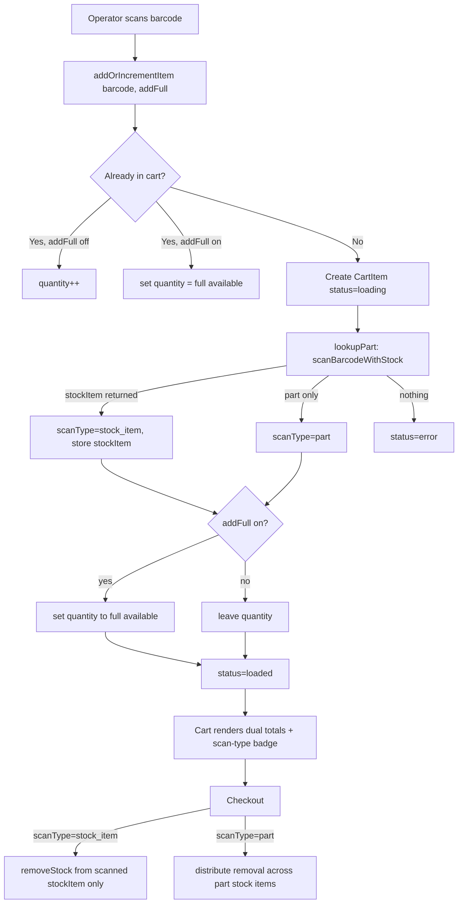

# Design Document: Stock-Aware Checkout

## Overview

This feature makes the self-checkout cart aware of *what* a scanned barcode points at — a specific Stock_Item (a batch) or just a parent Part. It builds on the existing `InventreeService.scanBarcodeWithStock()` method, which already returns `{ part, stockItem }` from a single barcode scan but is not yet used by the checkout flow (the cart currently calls `scanBarcode()`, which discards the stock item).

Three capabilities are added:

1. **Scan-type awareness** — each `CartItem` records whether it was resolved to a `stock_item` or a `part`, and stores the resolved `StockItem` when present.
2. **Dual totals display** — the cart shows the part-wide stock total always, plus the specific stock item's quantity (and batch) when a stock item was scanned.
3. **Add full quantity** — a persisted page-level toggle that, on scan, sets the cart quantity to the full available quantity for the scanned item (stock-item quantity for a `stock_item` scan, part total for a `part` scan).

Checkout removal is also made stock-item-targeted: a `stock_item` cart line draws down only the scanned stock item, while a `part` line keeps the existing distribute-across-all behavior.

The work is almost entirely in the `useCheckoutCart` composable plus `checkout.vue` template. No new server endpoints are needed; `scanBarcodeWithStock` already exists.

## Architecture



### Key Design Decisions

1. **Reuse `scanBarcodeWithStock` instead of `scanBarcode`.** The barcode-mode lookup in `useCheckoutCart.lookupPart` switches from `scanBarcode` (part only) to `scanBarcodeWithStock` (`{ part, stockItem }`). Part Search mode (`searchMode === 'part'`) keeps using `searchParts` and always yields `scanType: 'part'`. This is the minimal change that surfaces the stock item the barcode already points at.

2. **Extend `CartItem` in place** with `scanType` and `stockItem`. The cart already manages everything as a flat `CartItem`, so adding two fields keeps a single reactive store rather than a parallel structure. `scanType` defaults to `'part'` so existing logic and tests remain valid.

3. **Resolve "full quantity" at lookup completion, not at scan time.** When `addFullQuantity` is on, the quantity often cannot be known at the instant of scanning because the lookup is async. The composable therefore sets the full quantity inside `lookupPart` once the part/stock item resolves. For a re-scan of an already-loaded item, the full quantity is known synchronously and applied immediately. A `pendingFullQuantity` flag on the `CartItem` bridges the async case: it is set when the item is created under `addFullQuantity`, consumed when the lookup resolves, then cleared.

4. **Stock-item-targeted checkout.** The checkout loop branches on `scanType`. For `stock_item`, it removes the quantity from `item.stockItem.pk` directly (single `removeStock` call) and validates against `stockItem.quantity`. For `part`, it keeps the existing sorted distribution across `getStockItems(part.pk)`. This honors the batch the operator physically scanned.

5. **Stock-warning source depends on scan type.** `hasStockWarnings` and the per-item warning compare against `stockItem.quantity` for `stock_item` lines and `part.in_stock` for `part` lines.

6. **Toggle persistence via `localStorage`.** The `addFullQuantity` toggle is persisted under a dedicated key (`checkout_add_full_quantity`) and restored on mount, matching how `scan.vue` persists category/location selections.

## Components and Interfaces

### 1. Extended `CartItem` Interface (`useCheckoutCart.ts`)

```typescript
export type ScanType = 'part' | 'stock_item'

export interface CartItem {
  id: string
  barcode: string
  quantity: number
  status: CartItemStatus            // 'loading' | 'loaded' | 'error'
  part?: Part
  stockItem?: StockItem             // NEW: populated when scanType === 'stock_item'
  scanType: ScanType                // NEW: defaults to 'part'
  errorMessage?: string
  addedAt: number
  lastModifiedAt: number
  /** NEW (internal): set when created under addFullQuantity so the async
   *  lookup knows to set quantity to the full available amount on resolve. */
  pendingFullQuantity?: boolean
}
```

### 2. `useCheckoutCart` Signature Changes

```typescript
// addOrIncrementItem gains an options object (backward compatible).
addOrIncrementItem: (barcode: string, options?: { addFullQuantity?: boolean }) => CartItem | null
```

Behavioral changes:

- **`lookupPart(item)`**
  - Barcode mode: call `scanBarcodeWithStock(item.barcode)`.
    - `stockItem` present → `item.stockItem = stockItem`, `item.scanType = 'stock_item'`, `item.part = part`.
    - part only → `item.scanType = 'part'`.
    - neither → error state.
  - Part Search mode: unchanged (`searchParts`), `scanType = 'part'`.
  - After resolving, if `item.pendingFullQuantity` is set, compute `fullQuantityFor(item)` and assign it (fallback to 1 when zero/undefined), then clear the flag.

- **`addOrIncrementItem(barcode, { addFullQuantity })`**
  - Existing item:
    - `addFullQuantity` off → `quantity++` (unchanged).
    - `addFullQuantity` on → if full quantity is known (`status === 'loaded'`), set `quantity = fullQuantityFor(item)`; otherwise set `pendingFullQuantity = true` so the in-flight lookup applies it.
  - New item: create with `quantity: 1`, `scanType: 'part'` (provisional), `pendingFullQuantity: addFullQuantity === true`, then fire `lookupPart`.

- **`fullQuantityFor(item)`** (internal helper)
  - `stock_item` → `item.stockItem?.quantity`
  - `part` → `item.part?.in_stock`
  - returns a positive integer, or `1` as fallback when the source is missing/zero.

- **`checkout(options)`** — per item:
  - `scanType === 'stock_item'` and `item.stockItem`:
    - Validate `item.quantity <= item.stockItem.quantity` (already enforced by stock-warning gate, re-checked defensively).
    - Single `removeStock(item.stockItem.pk, { quantity, notes })`.
    - Receipt line attributes to `item.stockItem` (batch, pk, notes).
  - otherwise → existing distribution path via `getStockItems(part.pk)`.

- **`hasStockWarnings`** and a new exported helper/computed for per-item warning:
  - `stock_item` → compare `quantity > stockItem.quantity`.
  - `part` → compare `quantity > part.in_stock`.

### 3. `checkout.vue` Template Changes

- **Add full quantity toggle**: a `UCheckbox` (or `USwitch`) near the search controls/footer, bound to a `addFullQuantity` ref persisted to `localStorage`. `handleScan` passes `{ addFullQuantity: addFullQuantity.value }` into `addOrIncrementItem`.
- **Loaded item display**:
  - Always: `Part_Stock_Total` ("Total stock: N").
  - When `scanType === 'stock_item'`: an extra line "This batch: M" (plus batch label when `stockItem.batch`), and a small badge (e.g. "Stock Item" / "Batch") to distinguish from a part scan.
- **Stock warning styling**: extend the per-item warning to reflect the scan-type-aware availability.

### 4. `localStorage` Keys

| Key | Purpose |
|-----|---------|
| `checkout_add_full_quantity` | Persisted boolean for the Add_Full_Quantity toggle. |

The cart itself is not persisted today and remains session-only.

## Data Models

### CartItem (Extended)

| Field | Type | Description |
|-------|------|-------------|
| `id` | `string` | UUID |
| `barcode` | `string` | Scanned barcode |
| `quantity` | `number` | Quantity to remove |
| `status` | `'loading' \| 'loaded' \| 'error'` | Lifecycle state |
| `part` | `Part?` | Resolved part |
| `stockItem` | `StockItem?` | Resolved stock item (when `scanType === 'stock_item'`) |
| `scanType` | `'part' \| 'stock_item'` | What the barcode resolved to; defaults to `'part'` |
| `errorMessage` | `string?` | Error text when `status === 'error'` |
| `pendingFullQuantity` | `boolean?` | Internal: apply full quantity when async lookup resolves |
| `addedAt` | `number` | Created timestamp |
| `lastModifiedAt` | `number` | Last modified timestamp |

### StockItem (existing, unchanged)

Relevant fields: `pk`, `part`, `quantity`, `batch`, `barcode_hash`, `notes`.

## Correctness Properties

*A property is a characteristic that should hold across all valid executions of the system.*

### Property 1: Scan-type classification from lookup

*For any* barcode where `scanBarcodeWithStock` returns a non-null `stockItem`, the resulting `CartItem` has `scanType === 'stock_item'` and `stockItem` equal to the returned stock item; *for any* barcode returning a part with null `stockItem`, the `CartItem` has `scanType === 'part'` and no `stockItem`.

**Validates: Requirements 1.2, 1.3**

### Property 2: Not-found and error classification

*For any* barcode where `scanBarcodeWithStock` returns `{ part: null, stockItem: null }`, the `CartItem` transitions to `status === 'error'`; *for any* barcode where the call throws, the `CartItem` transitions to `status === 'error'` with the thrown message.

**Validates: Requirements 1.4, 1.5**

### Property 3: Full quantity on scan — stock item

*For any* `stock_item` scan with `addFullQuantity` enabled and a stock item quantity `q > 0`, the resulting `CartItem.quantity === q`.

**Validates: Requirements 3.4**

### Property 4: Full quantity on scan — part

*For any* `part` scan with `addFullQuantity` enabled and a part `in_stock` total `t > 0`, the resulting `CartItem.quantity === t`.

**Validates: Requirements 3.5**

### Property 5: Full quantity re-scan sets, not increments

*For any* already-loaded `CartItem` rescanned with `addFullQuantity` enabled, the `CartItem.quantity` equals the full available quantity for its scan type (not the previous quantity plus one).

**Validates: Requirements 3.6**

### Property 6: Full quantity fallback

*For any* scan with `addFullQuantity` enabled where the resolved full quantity is zero or undefined, the resulting `CartItem.quantity === 1`.

**Validates: Requirements 3.7**

### Property 7: Increment-by-one preserved when toggle off

*For any* sequence of scans of the same barcode with `addFullQuantity` disabled, the `CartItem.quantity` equals the number of times it was scanned.

**Validates: Requirements 3.3, 6.2**

### Property 8: Stock-warning source matches scan type

*For any* `CartItem`, it is flagged as a stock warning if and only if: (`scanType === 'stock_item'` and `quantity > stockItem.quantity`) or (`scanType === 'part'` and `quantity > part.in_stock`).

**Validates: Requirements 5.1, 5.2**

### Property 9: Stock-item-targeted removal

*For any* checkout of a `stock_item` `CartItem`, `removeStock` is called exactly once with the scanned `stockItem.pk` and the item's quantity, and `getStockItems` is not used to distribute that item's removal.

**Validates: Requirements 4.1**

### Property 10: Part removal distribution preserved

*For any* checkout of a `part` `CartItem`, the removal is distributed across the part's stock items via `getStockItems`, matching the pre-feature behavior.

**Validates: Requirements 4.2**

## Error Handling

| Scenario | Behavior |
|----------|----------|
| `scanBarcodeWithStock` returns both null | Item → `error`, "Barcode not found: <barcode>". |
| `scanBarcodeWithStock` throws | Item → `error` with thrown message (or generic network message). |
| `addFullQuantity` on but quantity source missing/zero | Quantity falls back to 1. |
| `stock_item` checkout requests > stock item quantity | Stock warning gate blocks checkout (Req 5.1); defensive re-check in checkout marks item error if reached. |
| `stock_item` removal call fails | Item → `error` with message; partial-success handling unchanged. |
| Re-scan of an in-flight (`loading`) item with toggle on | `pendingFullQuantity` set; full quantity applied when the lookup resolves. |
| `localStorage` unavailable/corrupt for toggle | Toggle defaults to disabled; no crash. |

## Testing Strategy

### Frameworks

- Unit/property tests: Vitest + fast-check (already used across the project).
- Component tests: Vitest + `@vue/test-utils`.

### Property-Based Tests (`useCheckoutCart`)

Each property above is implemented as a fast-check property test (≥100 runs) against `useCheckoutCart` with a mocked `InventreeService`. Arbitraries generate random barcodes, random `Part` objects (varying `in_stock`), and random `StockItem` objects (varying `quantity`, `batch`).

Test tags reference the design property, e.g.:
```
// Feature: stock-aware-checkout, Property 3: Full quantity on scan — stock item
```

- Properties 1–8 → `app/composables/__tests__/useCheckoutCart.spec.ts`
- Properties 9–10 → same file, asserting on the mocked service call shape (`removeStock` vs `getStockItems`).

### Unit / Integration Tests

- `scanBarcodeWithStock` wiring: barcode mode uses it; part-search mode does not.
- Toggle persistence round-trip via `localStorage`.
- Re-scan of an in-flight item applies full quantity once resolved (pendingFullQuantity path).
- Receipt line for a `stock_item` checkout attributes to the scanned stock item.
- Backward compatibility: a `part`-only barcode behaves exactly as before with the toggle off.

### Component Tests (`checkout.vue`)

- Loaded `stock_item` item renders both totals, the batch label, and the scan-type badge.
- Loaded `part` item renders only the part total and no batch line.
- Stock warning disables the checkout button using scan-type-aware availability.

### Test File Locations

- `app/composables/__tests__/useCheckoutCart.spec.ts` — Properties 1–10 + unit cases.
- `app/pages/__tests__/checkout.spec.ts` — component rendering tests.
