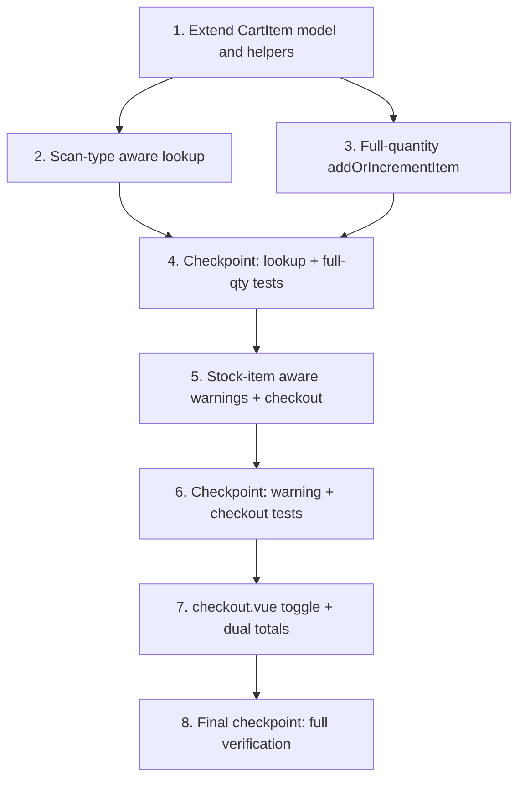

# Implementation Plan: Stock-Aware Checkout

## Overview

Make the self-checkout cart aware of whether a scanned barcode resolves to a specific Stock_Item or just a Part. Switch the cart's barcode lookup to the existing `scanBarcodeWithStock` service method, extend `CartItem` with `scanType`/`stockItem`, add a persisted "Add full quantity" toggle, make stock warnings and checkout removal stock-item-aware, and surface dual totals in the UI. Work is concentrated in `useCheckoutCart.ts` and `checkout.vue`; no new server endpoints are required.

## Task Dependency Graph



```json
{
  "waves": [
    { "wave": 1, "tasks": ["1"] },
    { "wave": 2, "tasks": ["2", "3"] },
    { "wave": 3, "tasks": ["4"] },
    { "wave": 4, "tasks": ["5"] },
    { "wave": 5, "tasks": ["6"] },
    { "wave": 6, "tasks": ["7"] },
    { "wave": 7, "tasks": ["8"] }
  ]
}
```

## Tasks

- [x] 1. Extend the CartItem model and cart helpers
  - [x] 1.1 Extend `CartItem` and add the `ScanType` type in `app/composables/useCheckoutCart.ts`
    - Add `export type ScanType = 'part' | 'stock_item'`
    - Add `scanType: ScanType` (default `'part'`), `stockItem?: StockItem`, and internal `pendingFullQuantity?: boolean` fields
    - Import `StockItem` from `~/types/inventree`
    - _Requirements: 1.2, 1.3_

  - [x] 1.2 Add the `fullQuantityFor(item)` internal helper
    - Returns `stockItem.quantity` for `stock_item`, `part.in_stock` for `part`
    - Returns `1` when the source value is missing, zero, or non-finite
    - _Requirements: 3.4, 3.5, 3.7_

- [x] 2. Make barcode lookup scan-type aware
  - [x] 2.1 Update `lookupPart` to use `scanBarcodeWithStock` in barcode mode
    - Barcode mode: call `inventreeService.scanBarcodeWithStock(item.barcode)`
    - `stockItem` present → set `scanType = 'stock_item'`, `stockItem`, and `part`
    - part only → set `scanType = 'part'`
    - neither → `status = 'error'` with "Barcode not found" message
    - Part Search mode (`searchMode === 'part'`): keep `searchParts`, force `scanType = 'part'`
    - On thrown error → `status = 'error'` with the error message
    - When `pendingFullQuantity` is set, assign `fullQuantityFor(item)` then clear the flag
    - _Requirements: 1.1, 1.2, 1.3, 1.4, 1.5, 1.6_

  - [x] 2.2 Write property test: Scan-type classification from lookup
    - **Property 1: Scan-type classification from lookup**
    - **Validates: Requirements 1.2, 1.3**
    - File: `app/composables/__tests__/useCheckoutCart.spec.ts`

  - [x] 2.3 Write property test: Not-found and error classification
    - **Property 2: Not-found and error classification**
    - **Validates: Requirements 1.4, 1.5**
    - File: `app/composables/__tests__/useCheckoutCart.spec.ts`

- [x] 3. Add full-quantity behavior to `addOrIncrementItem`
  - [x] 3.1 Add an options object to `addOrIncrementItem` and apply full-quantity logic
    - Signature: `addOrIncrementItem(barcode: string, options?: { addFullQuantity?: boolean })`
    - Existing item + toggle off → `quantity++` (unchanged)
    - Existing item + toggle on + loaded → set `quantity = fullQuantityFor(item)`
    - Existing item + toggle on + still loading → set `pendingFullQuantity = true`
    - New item → create with `quantity: 1`, `scanType: 'part'`, `pendingFullQuantity = addFullQuantity === true`
    - Update `UseCheckoutCart` interface signature accordingly
    - _Requirements: 3.3, 3.4, 3.5, 3.6, 3.7, 6.2_

  - [x] 3.2 Write property test: Full quantity on scan — stock item
    - **Property 3: Full quantity on scan — stock item**
    - **Validates: Requirements 3.4**
    - File: `app/composables/__tests__/useCheckoutCart.spec.ts`

  - [x] 3.3 Write property test: Full quantity on scan — part
    - **Property 4: Full quantity on scan — part**
    - **Validates: Requirements 3.5**
    - File: `app/composables/__tests__/useCheckoutCart.spec.ts`

  - [x] 3.4 Write property test: Full quantity re-scan sets, not increments
    - **Property 5: Full quantity re-scan sets, not increments**
    - **Validates: Requirements 3.6**
    - File: `app/composables/__tests__/useCheckoutCart.spec.ts`

  - [x] 3.5 Write property test: Full quantity fallback
    - **Property 6: Full quantity fallback**
    - **Validates: Requirements 3.7**
    - File: `app/composables/__tests__/useCheckoutCart.spec.ts`

  - [x] 3.6 Write property test: Increment-by-one preserved when toggle off
    - **Property 7: Increment-by-one preserved when toggle off**
    - **Validates: Requirements 3.3, 6.2**
    - File: `app/composables/__tests__/useCheckoutCart.spec.ts`

- [x] 4. Checkpoint - Ensure lookup and full-quantity tests pass
  - Run the composable test suite; resolve any failures before continuing.

- [x] 5. Make stock warnings and checkout removal stock-item aware
  - [x] 5.1 Update stock-warning evaluation to use scan-type-aware availability
    - `hasStockWarnings` compares against `stockItem.quantity` for `stock_item`, `part.in_stock` for `part`
    - Expose a per-item warning helper/computed for the template if needed
    - _Requirements: 5.1, 5.2, 5.3_

  - [x] 5.2 Branch `checkout` on scan type for removal
    - `stock_item` → single `removeStock(item.stockItem.pk, { quantity, notes })`; defensive re-check against `stockItem.quantity`
    - `part` → keep existing distribution via `getStockItems(part.pk)`
    - Receipt line for `stock_item` attributes to the scanned stock item (batch, pk, notes)
    - Preserve the existing barcode-traceability removal note
    - _Requirements: 4.1, 4.2, 4.3, 4.4, 4.5_

  - [x] 5.3 Write property test: Stock-warning source matches scan type
    - **Property 8: Stock-warning source matches scan type**
    - **Validates: Requirements 5.1, 5.2**
    - File: `app/composables/__tests__/useCheckoutCart.spec.ts`

  - [x] 5.4 Write property test: Stock-item-targeted removal
    - **Property 9: Stock-item-targeted removal**
    - **Validates: Requirements 4.1**
    - File: `app/composables/__tests__/useCheckoutCart.spec.ts`

  - [x] 5.5 Write property test: Part removal distribution preserved
    - **Property 10: Part removal distribution preserved**
    - **Validates: Requirements 4.2**
    - File: `app/composables/__tests__/useCheckoutCart.spec.ts`

- [x] 6. Checkpoint - Ensure warning and checkout tests pass
  - Run the composable test suite; resolve any failures before continuing.

- [x] 7. Update `checkout.vue` for the toggle and dual totals
  - [x] 7.1 Add the persisted "Add full quantity" toggle
    - Add an `addFullQuantity` ref, restore from `localStorage` (`checkout_add_full_quantity`) on mount, persist via watcher
    - Render a `UCheckbox`/`USwitch` control near the search/footer area
    - Pass `{ addFullQuantity: addFullQuantity.value }` from `handleScan` into `addOrIncrementItem`
    - _Requirements: 3.1, 3.2, 6.1_

  - [x] 7.2 Render dual totals and scan-type indicator for loaded items
    - Always show the part stock total
    - For `stock_item` items, additionally show the stock item quantity ("This batch: M") and batch label when present
    - Show a badge distinguishing a stock-item scan from a part scan
    - _Requirements: 2.1, 2.2, 2.3, 2.4, 2.5_

  - [x] 7.3 Write component test: stock-item item renders dual totals + badge
    - Loaded `stock_item` item shows both totals, batch label, and scan-type badge
    - Loaded `part` item shows only the part total and no batch line
    - File: `app/pages/__tests__/checkout.spec.ts`
    - _Requirements: 2.1, 2.2, 2.3, 2.4, 2.5_

- [x] 8. Final checkpoint - Full verification
  - Run the full test suite and the lint/build steps; resolve any failures.
  - Confirm backward compatibility: part-only barcode with toggle off behaves as before.
  - _Requirements: 6.1, 6.2, 6.3, 6.4_

## Notes

- The implementation reuses the existing `InventreeService.scanBarcodeWithStock()` — no new endpoints.
- `scanType` defaults to `'part'`, so existing cart behavior and tests remain valid when the new fields are absent.
- Property tests follow the established fast-check pattern in `useCheckoutCart.spec.ts`.
- Each task references specific requirements for traceability; checkpoints validate incrementally.
