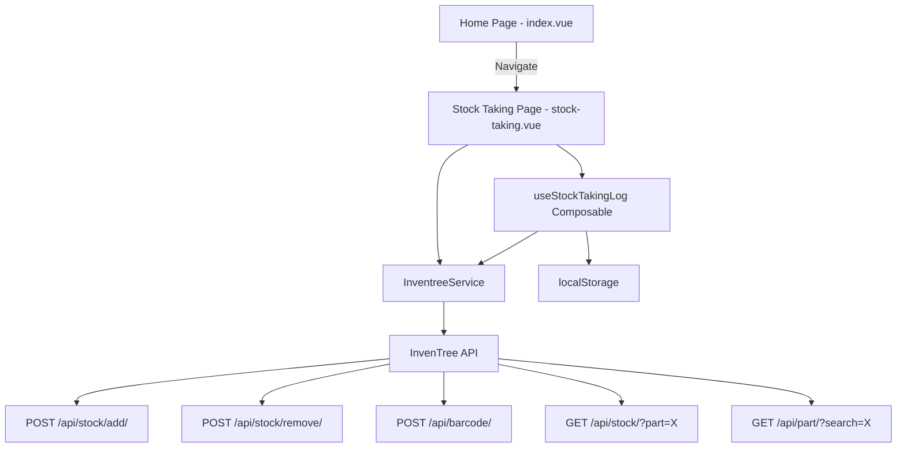

# Design Document: Stock Taking

## Overview

The Stock Taking feature adds a new `/stock-taking` page to the InvenTree webapp that mirrors the checkout page's barcode-scanning UX but repurposes it for physical inventory counts. Users scan items to build a log, verify or adjust counts against the system, and submit all changes in bulk using delta-based stock add/remove operations.

The feature consists of:
- A new home page navigation card
- A `useStockTakingLog` composable for log state management (modeled after `useCheckoutCart`)
- An `adjustStock` method on `InventreeService` for delta-based stock reconciliation
- A `stock-taking.vue` page with barcode input, log display, and bulk submission
- localStorage persistence for the log

## Architecture



The architecture follows the existing patterns:
- **Page** (`stock-taking.vue`) handles UI rendering, keyboard events, and user interactions
- **Composable** (`useStockTakingLog`) manages reactive state, barcode indexing, localStorage sync, and orchestrates API calls
- **Service** (`InventreeService`) handles HTTP communication with InvenTree

## Components and Interfaces

### 1. InventreeService — `adjustStock` method

New method added to the existing `InventreeService` class:

```typescript
interface AdjustStockParams {
  stockItemPk: number
  currentQuantity: number
  newQuantity: number
  notes?: string
}

async adjustStock(params: AdjustStockParams): Promise<void> {
  const delta = params.newQuantity - params.currentQuantity
  if (delta === 0) return

  if (delta > 0) {
    await this.api('/stock/add/', {
      method: 'POST',
      body: {
        items: [{ pk: params.stockItemPk, quantity: delta }],
        notes: params.notes || ''
      }
    })
  } else {
    await this.api('/stock/remove/', {
      method: 'POST',
      body: {
        items: [{ pk: params.stockItemPk, quantity: Math.abs(delta) }],
        notes: params.notes || ''
      }
    })
  }
}
```

### 2. useStockTakingLog Composable

Modeled after `useCheckoutCart`, this composable manages the stock taking log state.

```typescript
interface UseStockTakingLog {
  // State
  logEntries: Ref<StockTakeEntry[]>
  isSubmitting: Ref<boolean>
  searchMode: Ref<'barcode' | 'part'>

  // Actions
  addItem: (barcode: string) => Promise<StockTakeEntry | null>
  updateCount: (entryId: string, newCount: number) => boolean
  removeEntry: (entryId: string) => StockTakeEntry | null
  removeLastEntry: () => StockTakeEntry | null
  clearLog: () => void
  applyStockTake: () => Promise<StockTakeResult>
  setSearchMode: (mode: 'barcode' | 'part') => void
  highlightEntry: (entryId: string) => void
  loadFromStorage: () => void

  // Computed
  isEmpty: ComputedRef<boolean>
  hasErrors: ComputedRef<boolean>
  entryCount: ComputedRef<number>
}
```

Key differences from `useCheckoutCart`:
- `addItem` is async (waits for barcode resolution before adding to log, so the count field can be pre-filled)
- Duplicate detection returns the existing entry ID for highlighting instead of incrementing quantity
- Each entry stores both `systemCount` and `confirmedCount` (editable)
- localStorage sync on every mutation
- `applyStockTake` computes deltas and calls `adjustStock` per entry

### 3. Stock Taking Page (`stock-taking.vue`)

The page follows the checkout page layout:

```
┌─────────────────────────────────────┐
│ Stock Taking                        │
│ Scan items to verify stock counts   │
├─────────────────────────────────────┤
│ ┌─────────────────────────────────┐ │
│ │ Scan Barcode    [Barcode|Part]  │ │
│ │ [________________________]      │ │
│ └─────────────────────────────────┘ │
│ ┌─────────────────────────────────┐ │
│ │ Stock Take Log (N items)        │ │
│ │ ┌─────────────────────────────┐ │ │
│ │ │ Part Name    Barcode        │ │ │
│ │ │ System: 10   Count: [10]  X │ │ │
│ │ └─────────────────────────────┘ │ │
│ │ ┌─────────────────────────────┐ │ │
│ │ │ Part Name    Barcode        │ │ │
│ │ │ System: 5    Count: [ 3]  X │ │ │
│ │ └─────────────────────────────┘ │ │
│ └─────────────────────────────────┘ │
│ ┌─────────────────────────────────┐ │
│ │ Actions                         │ │
│ │   [Undo Esc] [Clear] [Apply]    │ │
│ └─────────────────────────────────┘ │
└─────────────────────────────────────┘
```

Keyboard behavior:
- Enter in barcode input → scan/search, add to log, clear input, re-focus input
- Enter/Tab on count field → confirm count, re-focus barcode input
- Escape anywhere → remove last entry, re-focus barcode input

### 4. Home Page Card

New card added to the grid in `index.vue`:

```vue
<UCard>
  <template #header>
    <div class="flex items-center gap-3">
      <div class="p-2 bg-teal-100 dark:bg-teal-900 rounded-lg">
        <UIcon name="i-lucide-clipboard-check" class="w-6 h-6 text-teal-600 dark:text-teal-400" />
      </div>
      <h2 class="text-xl font-semibold">Stock Taking</h2>
    </div>
  </template>
  <p class="text-gray-600 dark:text-gray-400 mb-4">
    Scan items to verify and adjust stock counts. Submit all changes in bulk.
  </p>
  <template #footer>
    <NuxtLink to="/stock-taking">
      <UButton block icon="i-lucide-arrow-right" trailing>
        Go to Stock Taking
      </UButton>
    </NuxtLink>
  </template>
</UCard>
```

## Data Models

### StockTakeEntry

```typescript
interface StockTakeEntry {
  /** Unique identifier (UUID) */
  id: string
  /** Scanned barcode or search query */
  barcode: string
  /** Resolved part data */
  part: Part
  /** Stock item pk used for adjustment */
  stockItemPk: number
  /** System's current stock count at time of scan */
  systemCount: number
  /** User-confirmed count (editable, defaults to systemCount) */
  confirmedCount: number
  /** Entry status */
  status: 'loaded' | 'error'
  /** Error message if resolution or submission failed */
  errorMessage?: string
  /** Timestamp when entry was added */
  addedAt: number
}
```

### StockTakeResult

```typescript
interface StockTakeResult {
  success: boolean
  processedItems: number
  skippedItems: number
  failedItems: StockTakeEntry[]
  message: string
}
```

### AdjustStockParams (added to inventree.ts types)

```typescript
interface AdjustStockParams {
  stockItemPk: number
  currentQuantity: number
  newQuantity: number
  notes?: string
}
```

### localStorage Schema

Key: `stock-taking-log`

```typescript
interface PersistedStockTakeLog {
  entries: StockTakeEntry[]
  savedAt: number
}
```

Serialized as JSON. Loaded on page mount, saved on every mutation.


## Correctness Properties

*A property is a characteristic or behavior that should hold true across all valid executions of a system — essentially, a formal statement about what the system should do. Properties serve as the bridge between human-readable specifications and machine-verifiable correctness guarantees.*

### Property 1: Log entry creation invariant

*For any* valid Part and stock item resolved from a barcode or search, the resulting StockTakeEntry SHALL have `confirmedCount` equal to `systemCount`, a valid `stockItemPk`, and the correct `part` data.

**Validates: Requirements 2.6, 4.1**

### Property 2: No duplicate log entries

*For any* Stock_Taking_Log and any barcode, scanning that barcode when an entry with the same barcode already exists SHALL NOT increase the log length. The log length before and after the duplicate scan SHALL be equal.

**Validates: Requirements 3.1**

### Property 3: Count update stores value

*For any* StockTakeEntry and any valid non-negative integer, calling `updateCount` with that value SHALL result in the entry's `confirmedCount` being equal to the provided value.

**Validates: Requirements 4.4**

### Property 4: Remove last entry

*For any* non-empty Stock_Taking_Log, calling `removeLastEntry` SHALL decrease the log length by exactly one and SHALL remove the entry that was most recently added.

**Validates: Requirements 5.1**

### Property 5: localStorage round-trip

*For any* Stock_Taking_Log state, persisting to localStorage and then restoring SHALL produce a log with entries equivalent to the original (same id, barcode, part, stockItemPk, systemCount, confirmedCount for each entry).

**Validates: Requirements 6.1, 6.2**

### Property 6: adjustStock positive delta calls add

*For any* pair of (currentQuantity, newQuantity) where newQuantity > currentQuantity, calling `adjustStock` SHALL invoke the stock add endpoint with quantity equal to (newQuantity - currentQuantity).

**Validates: Requirements 7.2, 9.2**

### Property 7: adjustStock negative delta calls remove

*For any* pair of (currentQuantity, newQuantity) where newQuantity < currentQuantity, calling `adjustStock` SHALL invoke the stock remove endpoint with quantity equal to (currentQuantity - newQuantity).

**Validates: Requirements 7.3, 9.3**

### Property 8: adjustStock zero delta is no-op

*For any* pair of (currentQuantity, newQuantity) where newQuantity equals currentQuantity, calling `adjustStock` SHALL NOT invoke any API endpoint.

**Validates: Requirements 7.4, 9.4**

### Property 9: Apply button disabled invariant

*For any* Stock_Taking_Log state, the "Apply Stock Take" button SHALL be disabled if and only if the log is empty OR the log contains at least one entry with status 'error'.

**Validates: Requirements 8.4**

## Error Handling

| Scenario | Handling |
|---|---|
| Barcode not found | Set Log_Entry status to 'error' with message "Barcode not found: {barcode}" |
| Part search returns no results | Set Log_Entry status to 'error' with message "Part not found for: {query}" |
| Part has no stock items | Set Log_Entry status to 'error' with message "No stock items found for part: {name}" |
| Network error during barcode scan | Set Log_Entry status to 'error' with the error message from the exception |
| adjustStock API failure | Throw error with descriptive message; caller retains failed entries in log |
| Bulk submission partial failure | Clear successful entries, retain failed entries with error status for retry |
| localStorage parse error on restore | Log warning, start with empty log (don't crash) |
| Invalid count value (negative, NaN) | Reject the update, keep previous confirmedCount |

## Testing Strategy

### Property-Based Testing

Use `fast-check` as the property-based testing library for TypeScript.

Each property test MUST:
- Run a minimum of 100 iterations
- Reference its design document property with a tag comment
- Be implemented as a single property-based test per property

Property tests cover:
- `adjustStock` delta computation (Properties 6, 7, 8)
- Composable state management: entry creation invariants, duplicate handling, remove-last, count updates (Properties 1, 2, 3, 4)
- localStorage round-trip (Property 5)

### Unit Testing

Unit tests complement property tests for specific examples, edge cases, and error conditions:

**InventreeService `adjustStock` unit tests:**
- Positive delta calls `/stock/add/` with correct quantity
- Negative delta calls `/stock/remove/` with correct absolute quantity
- Zero delta makes no API call
- API error propagates as thrown error with descriptive message
- Edge case: very large quantities
- Edge case: quantity of 0 for both current and new

**useStockTakingLog composable unit tests:**
- Adding an item via barcode creates entry with correct part data and pre-filled count
- Adding an item via part search creates entry with first stock item
- Barcode resolving to stock item (not part) retrieves associated part
- Scanning duplicate barcode returns existing entry ID (no new entry)
- Updating count stores the new value
- Removing last entry removes the most recently added
- Removing last entry from empty log returns null
- Clear log removes all entries
- localStorage persistence: entries survive save/load cycle
- localStorage restore handles corrupted/missing data gracefully
- Apply stock take with all zero deltas skips all API calls
- Apply stock take with mixed deltas calls correct endpoints
- Apply stock take clears log on full success
- Apply stock take retains failed entries on partial failure
- Apply button disabled when log is empty
- Apply button disabled when log has error entries
- Apply button enabled when log has only loaded entries
- Error entry created when barcode not found
- Error entry created when part has no stock items
- Error entry created on network failure during scan

**Page-level integration tests (stock-taking.vue):**
- Page renders with barcode input focused
- Barcode/part search mode toggle works
- Scanning barcode adds entry to log display
- Duplicate scan highlights existing entry
- Enter/Tab on count field returns focus to barcode input
- Escape key removes last entry
- Clear Log button empties the log
- Apply Stock Take button triggers bulk submission
- Apply button is disabled when log is empty
- Loading state shown during submission
- Success notification shown after successful apply
- Error notification shown on failed apply
- Empty state message shown when log is empty

### Test File Organization

- `app/services/__tests__/inventree.service.adjustStock.spec.ts` — adjustStock method unit + property tests (Properties 6, 7, 8)
- `app/composables/__tests__/useStockTakingLog.spec.ts` — composable unit + property tests (Properties 1, 2, 3, 4, 5, 9)
- `app/pages/__tests__/stock-taking.spec.ts` — page integration tests
